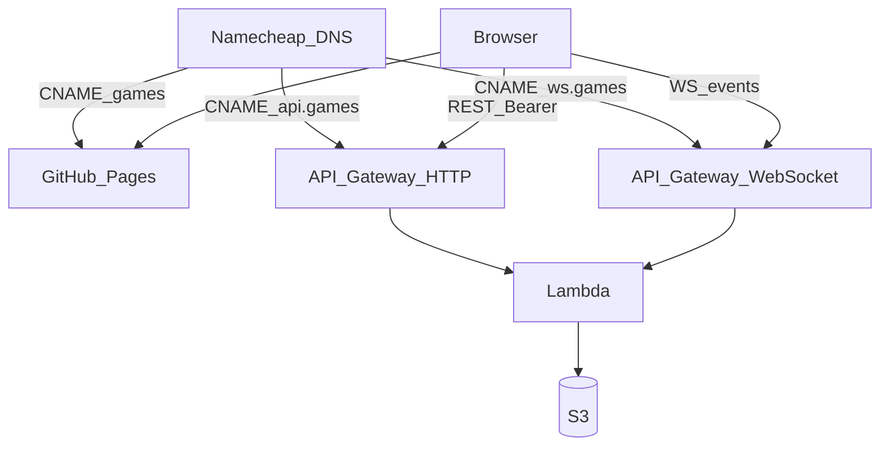

# ADR 0002 — Cheap async online multiplayer

**Status:** Accepted
**Date:** 2026-08-13
**Context:** [`SPEC.md`](../../SPEC.md) §1 (delivery shape), [ADR 0001](./0001-pure-core-and-pluggable-geometry.md), packets [P14](../design/packets/P14-online-adr.md)–[P20](../design/packets/P20-deferred-online-followons.md)

## Context

Playtest is a client-only game on GitHub Pages (`games.hochgi.com/arrows_conqueror/`). The rules engine is a pure `apply(state, move) → state` (ADR 0001). That makes an authoritative server cheap: re-`apply` on the server, store state + log, never invent a second rules engine.

Constraints that drove the rest:

- Hobby cost floor: Lambda + S3 + API Gateway. No DynamoDB, no Cognito, no Route53 hosted zone.
- Personal AWS only — never employer / Versatile.
- Grain fairness: online seats are **3 or 6** (same as the playtest lobby). Two-player mirror play was unfair.
- Async: players need not be online at the same time. A WebSocket is a wake-up, not a lockstep session.
- Future games may share `*.games.hochgi.com`. Do not mint per-game API subdomains.

## Decision

### 1. Authority and purity

The browser is untrusted. Lambda loads state, checks the move is legal for the bound seat, calls the same `rules-core` `apply`, writes S3, notifies. Heuristic AI runs **in that same invocation** after a human move, until the next seat is human or the game ends. One conditional put + log append for the whole burst. Timeout leaves S3 unchanged so the client retries the same move + version.

The core stays pure. Adapters may use clocks and CSPRNG (invite tokens, JWT `exp`).

### 2. Who is allowed to cost money

**AWS is used only when a lobby has ≥2 human seats, all bound.** One human plus heuristic AI, and all-AI, stay in the browser — today's local lobby — and **must not write S3**.

### 3. Identity, groups, games

- Google OIDC ID token verified in Lambda. `sub` is the stable player id.
- `userHash = truncate16(SHA-256(sub))` (32 lowercase hex chars).
- `groupHash = truncate16(SHA-256(sorted userHashes joined by `\n`))`. **Humans only.** Seat order, 3-vs-6, and heuristic seats are not in the preimage. The same people always share one group folder. Hashing is order-independent because the list is sorted.
- A **game** is `groups/<groupHash>/games/<NNNNNN>/` with `NNNNNN` a 6-digit counter from `1`. Rematch allocates the next integer. **Existing game objects are never overwritten.**
- Equivalent to the informal id `${groupHash}_${counter}`: the counter is a path segment, not part of the hash.

### 4. Seats and meta

Each game `meta.json` records ordered seats:

```text
seats: [{ kind: "human", userHash }, { kind: "heuristic" }, …]
```

Length 3 or 6. The FE shows "B is AI" from this, not by guessing.

### 5. Invites

Opaque token URL (not a short PIN). Host occupies the first human seat. Invitees take the next unbound human seat. Full → 409, no viewers.

**No TTL.** Host may revoke. After **Start**, the token is 410. Started games never expire.

Start is allowed only when every **human** seat is bound and there are ≥2 of them. It open-or-creates the group and allocates the next game number.

### 6. Store and notify

S3 is the database. Key prefix `arrows_conqueror/` so another game can share the bucket.

```text
arrows_conqueror/users/<userHash>/groups/<groupHash>
arrows_conqueror/groups/<groupHash>/meta.json          # nextGameNumber, membership
arrows_conqueror/groups/<groupHash>/games/NNNNNN/meta.json
arrows_conqueror/groups/<groupHash>/games/NNNNNN/state.json
arrows_conqueror/groups/<groupHash>/games/NNNNNN/log.jsonl
arrows_conqueror/invites/<token>.json
arrows_conqueror/connections/<userHash>/<connectionId>
```

`GET /my-games` is that user's membership pointers only.

WebSocket payload is only `{ type: "stateChanged", version, groupHash, gameNumber }`. The client then GETs state. `visibilitychange` is a safety net, not a poll loop. Connection registry lives in S3 (`$connect` / `$disconnect`).

Move Lambda: **60 s timeout, 1024 MB**. Worst burst: 4 consecutive heuristic seats (6-player, two humans on opposite corners).

### 7. URLs and deploy

| Surface | URL |
|---|---|
| FE | `https://games.hochgi.com/arrows_conqueror/` (Pages, `shalevhoch` fork) |
| HTTP | `https://api.games.hochgi.com/arrows_conqueror/…` |
| WS | `wss://ws.games.hochgi.com/arrows_conqueror` |

API Gateway **base-path mapping** `/arrows_conqueror` on shared custom domains. A later game adds a mapping, not a hostname.

Namecheap CNAMEs only. No NS-delegation of `games`. No new Route53 zone.

Code: TypeScript in-repo (`infra/` + `packages/online-api/`), bundles `rules-core`. **SAM + GitHub Actions OIDC from `hochgi/arrows_conqueror` to the owner's personal AWS account.** Do not put that OIDC role on the son's fork. Do not deploy to employer AWS.



### 8. Authz for a move

`POST …/moves` succeeds only if the bearer `sub` maps to the **active** human seat. Heuristic seats never present a Google token. Stale `If-Match` → 412. Illegal move → 422. No write on those paths.

## Consequences

### Good

- Same `apply` on both sides: desync is a bug in bundling, not a second ruleset.
- Rematches cannot clobber history.
- One-human vs AI costs nothing on AWS.
- Shared `api.games` / `ws.games` hostnames leave room for other hobby games.

### Costs

- S3-as-index is clumsy for queries; `/my-games` is pointer-fan-in, not a scan.
- WebSocket connection registry in S3 is not elegant; it is cheap at family scale.
- Split deploy: Pages on `shalevhoch`, API on `hochgi`.
- Heuristic burst can make a human wait on Lambda time (accepted; 60s budget).

### Rejected alternatives

- **Cognito + DynamoDB.** Correct at work; overkill and idle cost here.
- **Per-game API subdomains.** Fights the "one games zone" DNS story.
- **Go/Rust Lambdas.** Would fork `rules-core`. Language cost is noise next to S3.
- **Content-address including seat plan.** Same two people in 3p vs 6p would be different groups; the library would split.
- **Concatenated `${hash}_${counter}` as the only id.** Same identity, worse listing; path segments already do this.
- **1-human online.** Would bill AWS for what the browser already does.
- **Invite TTL.** Abandoned lobby objects are tiny; host revoke is enough.
- **Viewers, arena, Elo, online BYOK, auto-replay.** [P20+](../design/packets/P20-deferred-online-followons.md).

## Follow-on packets

P16 SAM/CI/DNS → P17 auth+invites → P18 moves+WS → P19 Pages client.
