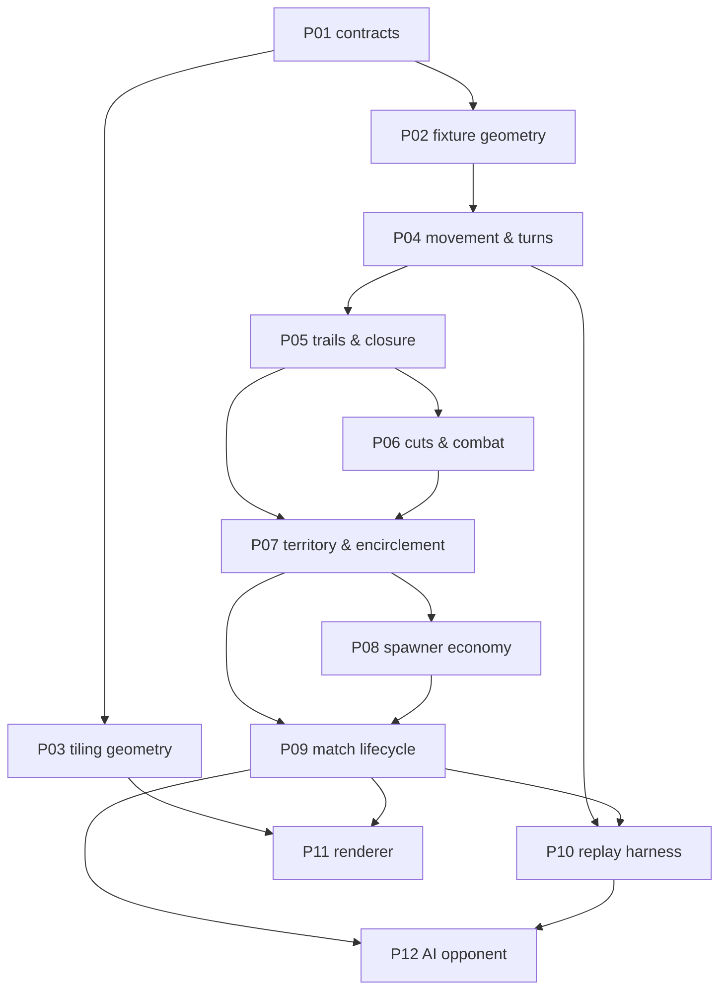

# 02 — Work packets: index, dependencies, build order

> **Status:** Draft for review.
> Each packet is one encapsulated unit of work, sized for a single `/spec-to-ship`
> run (spec → tests → code → review, human gate between phases). A packet doc is
> the **phase-1 input**: it fixes scope, decisions, invariants and a scenario
> inventory; the spec-author session turns those into Gherkin + EARS with the
> human in the loop.
>
> Everything here is derived from [`SPEC.md`](../../SPEC.md). The § references
> point at the section that owns the behaviour.

## Packet index

| # | Packet | Layer | SPEC | Depends on | Gate / risk |
|---|---|---|---|---|---|
| P01 | Contracts: ports & DTOs | foundation | §2–7 | — | port shape is derivable from the spec without the tiling measurement |
| P02 | Fixture geometry (hand-authored boards) | foundation | §2 | P01 | none — unblocks every rules packet before the real tiling exists |
| P03 | Tiling geometry & torus wrap | foundation | §2 | P01 | **closes §11 items 1, 5, 16.** The only measurement in the project |
| P04 | Movement, stacks & the turn loop | rules | §2–4 | P01, P02 | harmonic banking must be exact rationals, not floats |
| P05 | Trails, crossings & closure | rules | §2, §5, §7 | P04 | the chord test and even-odd fill are the subtlest logic in the game |
| P06 | Cuts, evaporation & combat | rules | §6 | P05 | fork evaporation charging (§11 item 8) still open |
| P07 | Territory & encirclement | rules | §7 | P05, P06 | conversion must conserve total heads exactly |
| P08 | Spawner economy | rules | §7 | P07 | §11 item 15 (spawning onto a contested arrow) still open |
| P09 | Match lifecycle, setup & victory | rules | §8, §9 | P07, P08 | the turtle stalemate is an accepted risk (§9) — watch for it here |
| P10 | Replay & determinism harness | cross-cutting | — | P04, P09 | the primary detector of accidental nondeterminism |
| P11 | Renderer (torus board) | adapter | §2, §7 | P03, P09 | reading a wrapping board is a real UX problem |
| P12 | AI opponent | adapter | all | P09, P10 | needs a searchable, pure core — depends on P10 holding the line |

## Dependency graph

## Build order and why

**P01–P02 first, and P03 in parallel.** The rules are the product; the tiling is
a measurement. Splitting fixture geometry from real geometry means every rules
packet can proceed against small hand-authored boards with known adjacency while
the extraction happens independently — same `GeometryPort`, same tests. This is
the single most important sequencing decision in the plan; collapsing P02 and P03
would block the entire game behind a measuring task.

**P04 → P05 → P06 → P07 is a genuine chain.** Closure needs movement; cuts need
trails to cut; territory needs both closure and the encirclement that combat
produces. Do not try to parallelise these — the interactions are the game.

**P08 after P07**, because a spawner share is ownership of an arrow *as
territory*, so there is nothing to accrue to until territory exists.

**P10 early enough to matter.** The replay harness is worth landing as soon as
there is a turn loop to replay. Its value is not regression coverage, it is that
it catches nondeterminism *while the core is still small enough to find it*.

## Open items this plan inherits

Tracked in [`SPEC.md` §11](../../SPEC.md). The ones with a packet owner:

- items 1, 5, 16 — the geometry measurement → **P03**
- item 8 — which stack a fork's evaporation charges → **P06**
- item 15 — spawning onto a contested arrow → **P08**
- items 6, 7, 9, 10 — combat and merge constants → **P06**, **P04**
- items 11, 12 — player count, board size, special density → **P09**

An item with no packet owner is a scoping gap, not a decision. Say so rather than
absorbing it.

## Packet docs

Individual packet docs live in `./packets/PNN-<slug>.md` and are written
just-in-time, immediately before the `/spec-to-ship` run that consumes them.
Writing them all up front would bake in assumptions that earlier packets are
about to invalidate.
