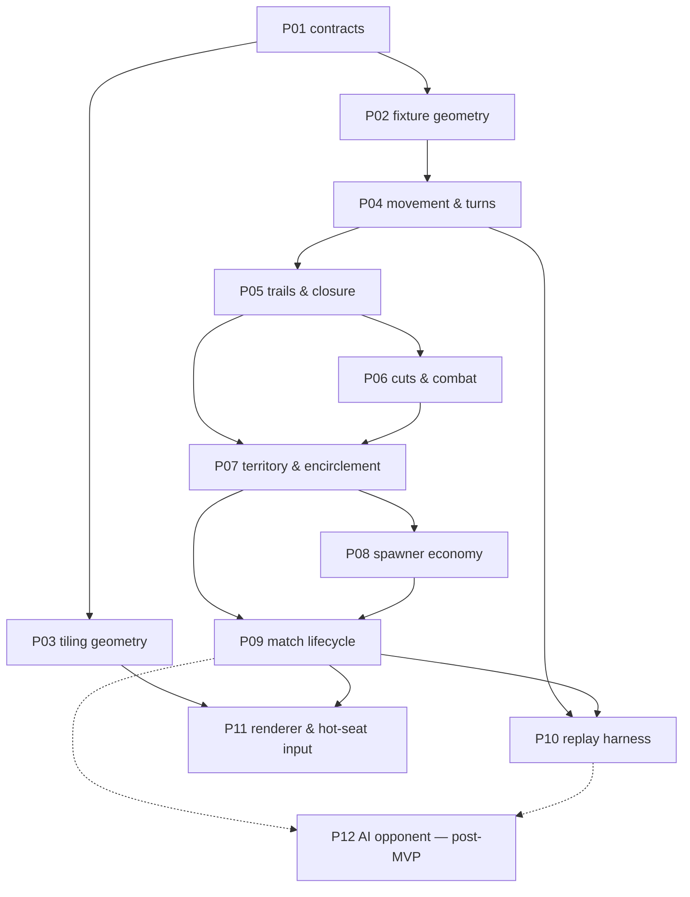

# 02 — Work packets: index, dependencies, build order

> **Status:** Draft for review.
> Each packet is one encapsulated unit of work, sized for a single `/spec-to-ship`
> run (spec → tests → code → review, human gate between phases). A packet doc is
> the **phase-1 input**: it fixes scope, decisions, invariants and a scenario
> inventory; the spec-author session turns those into Gherkin + EARS with the
> human in the loop.
>
> Everything here is derived from [`SPEC.md`](../../SPEC.md). The § references
> point at the section that owns the behaviour.

## MVP scope

MVP is **stateless, client-only, hot-seat** (SPEC §1). Two players alternating on
one machine, no save/resume, no server, no AI.

That trims the plan rather than reshaping it: **P12 leaves MVP**, and P11 becomes
the only adapter that ships. Nothing moves the other way — there was never a
persistence or netcode packet, because ADR 0001 kept both outside the core by
construction.

**P10 stays in, and its justification changes.** With no save/resume it is not a
product feature; it is the determinism detector, which is the reason it was
scheduled early in the first place.

## Packet index

| # | Packet | Layer | SPEC | Depends on | Gate / risk |
|---|---|---|---|---|---|
| P01 | Contracts: ports & DTOs | foundation | §2–7 | — | unblocked — §11 item 19 settled the `Move` DTO: one unit, one step |
| P02 | Fixture geometry (hand-authored boards) | foundation | §2 | P01 | **owes the repo a green conformance suite.** P01 leaves `runGeometryPortConformance` pending behind a `describe.skip`; P02 must delete that wrapper, point the factory at a fixture board, and make all 27 pass **unchanged**. If the suite needs editing, the port leaked something concrete. **Answer §11 item 29 first** — whether a fixture must have alternating in/out slots decides which boards are legal to author, and the suite currently asserts distinctness only |
| P03 | Tiling generator & torus wrap | foundation | §2 | P01 | now a **generator**, not an extraction — the tiling is the oriented triangular lattice with an alternating junction pattern (§11 item 1, resolved). Nothing left to measure; runs the same conformance suite as P02 |
| P04 | Movement, stacks & the turn loop | rules | §2–4 | P01, P02 | allowance is an **integer** — `speed(N) = 1 + floor(log₂ N)`, nothing carried between turns. No rationals on this path; exact rationals belong to the §7 accumulators (P08) |
| P05 | Trails, crossings & closure | rules | §2, §5, §7 | P04 | the chord test and even-odd fill are the subtlest logic in the game. Fill must read the trail's **arrow set** and use `chordsInterleave`, not `chordsCross` (§6.1a). A point presents `i × o` chords, not one — extracting them is this packet's job, and `chordsCross` is called once per chord. Also owns §5's branch-anchor legality: a move creating a join or a split must leave a head |
| P06 | Cuts, evaporation & combat | rules | §6 | P05 | **§6 was rebuilt twice after P01 landed.** Bidirectional evaporation, one kill per front, 1:1 per-move combat — then bare trail, **all-to-all points**, and **per-arrow halting** (a head does *not* shield the point ahead against fire; that range is combat's alone). Two grades of anchor, territory and stack, and conflating them breaks §6.3 |
| P07 | Territory & encirclement | rules | §7 | P05, P06 | conversion must conserve total heads exactly |
| P08 | Spawner economy | rules | §7 | P07 | exact rationals only — **the accumulator is the one thing in the game that banks**; blockades halt accrual and cost the share. Accrual takes *a* force per spawner and must never read its value: **no branch on 1/3 vs 1/12, no threshold against a constant** (§7, *placement and force are setup data*). MVP defaults are playtest-first (§11 items 12 and 25) and a retune must not change which scenarios pass |
| P09 | Match lifecycle, setup & victory | rules | §8, §9 | P07, P08 | the turtle stalemate is an accepted risk (§9) — watch for it here. **Owns the spawner tuning table**: which eligible vertices carry a spawner, band boundaries, force per band — one input read once at setup, not conditions spread through placement (§7) |
| P10 | Replay & determinism harness | cross-cutting | — | P04, P09 | the primary detector of accidental nondeterminism |
| P11 | Renderer & hot-seat input | adapter | §2, §5, §7 | P03, P09 | the only shipping adapter. Galcon-style source→destination→portion input; trail-vs-territory must be legible at a glance (§5) |
| ~~P12~~ | ~~AI opponent~~ | — | — | — | **out of MVP** (hot-seat). Kept in the graph because P10 exists partly to make it cheap later |

## Dependency graph

## Build order and why

**P01–P02 first, and P03 in parallel.** The tiling is fully known — the oriented
triangular lattice with alternating junctions (§2, §11 item 1) — so P03 generates
a board from two basis vectors and a modulus rather than tracing an image, and
there is no measurement left anywhere in the plan. Keeping fixture geometry
separate still pays: rules packets test against small hand-authored boards with
known adjacency, which make failures readable, while both implementations answer
to the same `GeometryPort` and the same conformance suite.

**P02 is the closest thing to a hard prerequisite.** Until it lands, 27 of P01's
tests are pending rather than passing, so the repo has no board and no rules
packet can be tested against one.

**P04 → P05 → P06 → P07 is a genuine chain.** Closure needs movement; cuts need
trails to cut; territory needs both closure and the encirclement that combat
produces. Do not try to parallelise these — the interactions are the game.

**P08 after P07**, because a spawner share is ownership of an arrow *as
territory*, so there is nothing to accrue to until territory exists.

**P10 early enough to matter.** The replay harness is worth landing as soon as
there is a turn loop to replay. Its value is not regression coverage, it is that
it catches nondeterminism *while the core is still small enough to find it*.

## Open items this plan inherits

Tracked in [`SPEC.md` §11](../../SPEC.md): **one structural question, two tuning
knobs.** No geometric measurement remains — items 1, 5 and 16 are all resolved, so
P03 generates rather than extracts. Nothing blocks P01 or P04.

- **item 29** — must *every* board have alternating in/out slots, or only the
  generated tiling? Resolving item 1 turned the pattern from a measurement into a
  rule, and no invariant enforces it: a fixture board with three-consecutive
  in-slots passes the whole conformance suite while contradicting §2. Decides
  what a legal fixture is, so it is not a test-coverage detail → **P02**, P03 to
  confirm
- **item 11** — board size `(n, m)`, and MVP player count fixed at 2 → **P09**
- **item 12** — spawner density, resolved as *non-uniform*: dense and fast in the
  contested centre, sparse and slow at home. MVP defaults are written down and
  explicitly playtest-first → **P09**

Items 11 and 12 are a single balance sweep against total spawner force, and want
a playable game rather than an argument — which is why P09 owns them and why the
replay harness (P10) lands right behind it.

Neither is a blocker, and the reason is a constraint rather than an accident:
§7's *placement and force are setup data* keeps every one of these numbers on the
setup side of the port. Build against the defaults now; the sweep later is a
table edit, and if it turns out not to be, that is a defect in P08 or P09.

**Item 20 is closed and the plan used to say otherwise.** The two "residual carry
edges" it listed dissolved when §3 dropped banking — there are no carries to
forfeit or duplicate, so P04 inherits nothing from it.

An item with no packet owner is a scoping gap, not a decision. Say so rather than
absorbing it.

## Packet docs

Individual packet docs live in `./packets/PNN-<slug>.md` and are written
just-in-time, immediately before the `/spec-to-ship` run that consumes them.
Writing them all up front would bake in assumptions that earlier packets are
about to invalidate.
