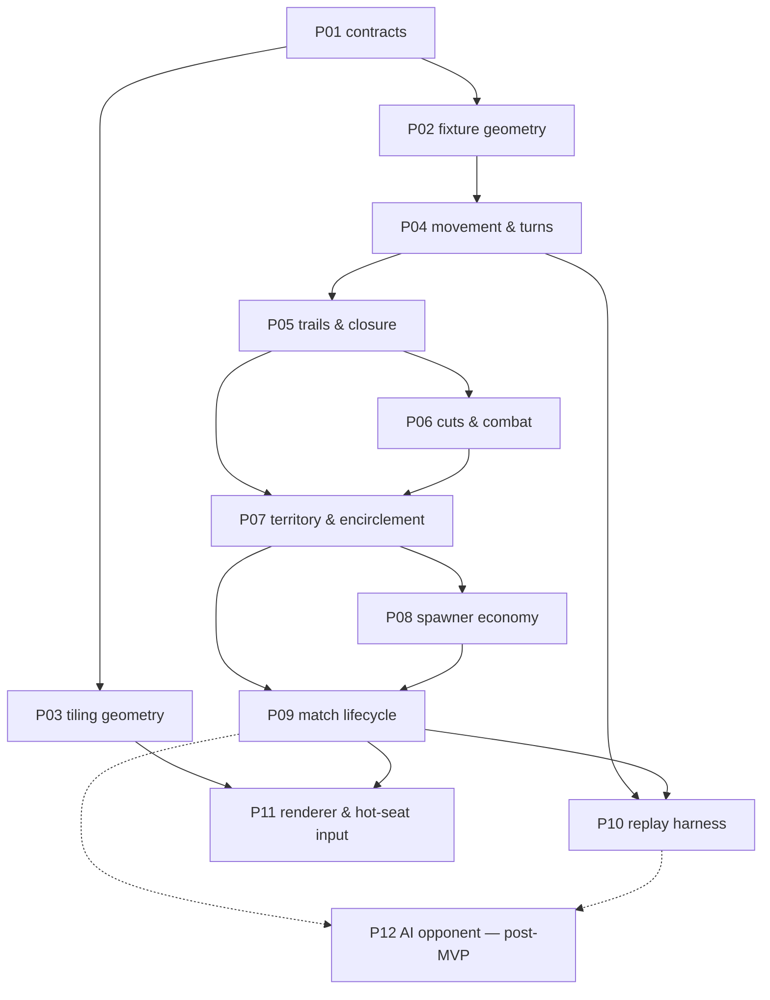

# 02 — Work packets: index, dependencies, build order

> **Status:** Draft for review.
> Each packet is one encapsulated unit of work, sized for a single `/spec-to-ship`
> run (spec → tests → code → review, human gate between phases). A packet doc is
> the **phase-1 input**: it fixes scope, decisions, invariants and a scenario
> inventory; the spec-author session turns those into Gherkin + EARS with the
> human in the loop.
>
> Everything here is derived from [`SPEC.md`](../../SPEC.md). The § references
> point at the section that owns the behaviour.

## MVP scope

MVP is **stateless, client-only, hot-seat** (SPEC §1). Two players alternating on
one machine, no save/resume, no server, no AI.

That trims the plan rather than reshaping it: **P12 leaves MVP**, and P11 becomes
the only adapter that ships. Nothing moves the other way — there was never a
persistence or netcode packet, because ADR 0001 kept both outside the core by
construction.

**P10 stays in, and its justification changes.** With no save/resume it is not a
product feature; it is the determinism detector, which is the reason it was
scheduled early in the first place.

## Packet index

| # | Packet | Layer | SPEC | Depends on | Gate / risk |
|---|---|---|---|---|---|
| P01 | Contracts: ports & DTOs | foundation | §2–7 | — | unblocked — §11 item 19 settled the `Move` DTO: one unit, one step |
| P02 | Fixture geometry (hand-authored boards) | foundation | §2 | P01 | none — unblocks every rules packet before the real tiling exists |
| P03 | Tiling generator & torus wrap | foundation | §2 | P01 | now a **generator**, not an extraction — the tiling is the oriented triangular lattice. Only the junction orientation pattern (§11 item 1) is still measured |
| P04 | Movement, stacks & the turn loop | rules | §2–4 | P01, P02 | harmonic banking must be exact rationals, not floats |
| P05 | Trails, crossings & closure | rules | §2, §5, §7 | P04 | the chord test and even-odd fill are the subtlest logic in the game |
| P06 | Cuts, evaporation & combat | rules | §6 | P05 | two-step crossings: the gate and the casualty are separate stacks |
| P07 | Territory & encirclement | rules | §7 | P05, P06 | conversion must conserve total heads exactly |
| P08 | Spawner economy | rules | §7 | P07 | exact rationals only; blockades halt accrual and cost the share |
| P09 | Match lifecycle, setup & victory | rules | §8, §9 | P07, P08 | the turtle stalemate is an accepted risk (§9) — watch for it here |
| P10 | Replay & determinism harness | cross-cutting | — | P04, P09 | the primary detector of accidental nondeterminism |
| P11 | Renderer & hot-seat input | adapter | §2, §7 | P03, P09 | the only shipping adapter; reading a wrapping board is a real UX problem |
| ~~P12~~ | ~~AI opponent~~ | — | — | — | **out of MVP** (hot-seat). Kept in the graph because P10 exists partly to make it cheap later |

## Dependency graph

## Build order and why

**P01–P02 first, and P03 in parallel.** The tiling is now known to be the
oriented triangular lattice (§2), so P03 generates a board from two basis vectors
and a modulus rather than tracing an image. Keeping fixture geometry separate
still pays: rules packets test against small hand-authored boards with known
adjacency, which make failures readable, while P03 settles the one remaining
measurement — the junction orientation pattern — behind the same `GeometryPort`.

**P04 → P05 → P06 → P07 is a genuine chain.** Closure needs movement; cuts need
trails to cut; territory needs both closure and the encirclement that combat
produces. Do not try to parallelise these — the interactions are the game.

**P08 after P07**, because a spawner share is ownership of an arrow *as
territory*, so there is nothing to accrue to until territory exists.

**P10 early enough to matter.** The replay harness is worth landing as soon as
there is a turn loop to replay. Its value is not regression coverage, it is that
it catches nondeterminism *while the core is still small enough to find it*.

## Open items this plan inherits

Tracked in [`SPEC.md` §11](../../SPEC.md): **one measurement, two tuning knobs,
and three recorded readings.** Nothing blocks P01.

- **item 20** — the three residual edges of the per-step turn model (does a skip
  bank, does a merge forfeit an inherited bank, is splitting symmetric). Each has
  a strong reading written down; confirm before the code hardens them → **P04**
- **item 1** — the junction orientation pattern (alternating vs three-consecutive).
  Alternating is the strong read; confirm it → **P03**
- **item 11** — board size `(n, m)`, and MVP player count fixed at 2 → **P09**
- **item 12** — spawner density as a fraction of the `2nm` eligible vertices → **P09**

Items 11 and 12 are a single balance sweep against total spawner force, and want
a playable game rather than an argument — which is why P09 owns them and why the
replay harness (P10) lands right behind it.

An item with no packet owner is a scoping gap, not a decision. Say so rather than
absorbing it.

## Packet docs

Individual packet docs live in `./packets/PNN-<slug>.md` and are written
just-in-time, immediately before the `/spec-to-ship` run that consumes them.
Writing them all up front would bake in assumptions that earlier packets are
about to invalidate.
