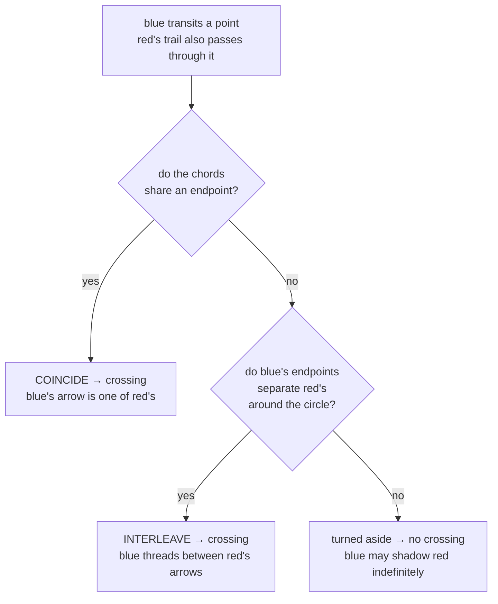

# chord-test — when a traversal is a crossing

**Packet:** [P01 — Contracts](../../design/packets/P01-contracts.md)
**SPEC:** §2 ("Trails own points, not just arrows", "The chord test")
**Features:** [core](./chord-test.core.feature) · [edge cases](./chord-test.edge-cases.feature)

## Purpose

This is the only part of P01 that encodes a **rule** rather than a shape, and it
is the subtlest logic in the game. It is also small enough to specify totally.

Two counts, and using the wrong one is a trap. Six slots give **15 distinct
chords and 225 ordered pairs** — that is the predicate's domain, and the size a
lookup-table implementation has to be. A *layout* — which three slots are
in-slots — makes only 9 of them realizable as a transit, so a point sees **81
reachable pairs**. The predicate deliberately does not know the layout (see the
last invariant), so it must answer all 225. Build the 9×9 table and it throws on
the six chords no layout realizes.

## The problem it solves

Consecutive arrows in a trail meet at a **point** — they share a vertex, not an
edge. Two tiles touching at a single point do not form a barrier. This is the
diagonal-leak problem from flood fill, where 8-connected movement escapes a
4-connected wall: if crossing meant "landed on a trail arrow", an enemy could
thread through the gap between two trail arrows without touching either, and
every enclosure in the game would leak.

> **A trail owns the points it passes through.** Crossing is traversing a point
> on the trail, not occupying its arrows.

## Terms

| Term | Means |
|---|---|
| **slot** | one of the six arrow positions around a point, in cyclic order (3 in, 3 out) |
| **chord** | the pair (in-slot, out-slot) a path draws when it transits a point |
| **interleave** | one chord's endpoints separate the other's around the circle |
| **coincide** | the two chords share an endpoint — one path's arrow is the other's |
| **crossing** | any traversal of a point another trail passes through |
| **cut** | a crossing where the other trail belongs to an enemy (§6.1) |

Most crossings are not cuts. *Crossing* is the geometric test; *cut* is what §6
does with the result when the trails belong to different players.

## The rule

## What follows for free

Because the test is on the **exit choice** rather than on arrival, crossing is a
decision, not a tripwire. Three behaviours emerge with no extra design:

- A head can **shadow** an enemy trail, travelling alongside it point after
  point without triggering combat, choosing its moment.
- A defender can **hold a contested point** without committing to a fight.
- Two trails can **race in parallel** through the same corridor, mutually aware
  and mutually unobligated — until one of them turns.

Enemy cut (§6.1) and where combat resolves (§6.2) both take the full verdict.
**Even-odd fill (§7) takes the interleave half alone**, because coincidence
cannot invert anything: fill reads the trail's arrow set (§6.1a), and
re-traversing an arrow the trail already holds leaves that set unchanged. So the
port exposes both `chordsInterleave` and `chordsCross`, and the relationship
between them is itself an invariant rather than two independent tests.

## One point can present several chords — and that is the caller's problem

This predicate compares **two chords**. Extracting a trail's chords at a point is
the caller's job, and it is not always one.

A point is **all-to-all** (SPEC §6.1a): where a trail uses `i` in-arrows and `o`
out-arrows there, it is a join followed by a split, so it presents **`i × o`
chords** — one per (in, out) pair. A spine gives one, a fork or a join two, a
crossover four, a triple crossover nine. The caller tests against each.

That matters because the alternative was a port change. The arrow set holds no
pairing to recover — a walk that went `a→a, b→b` and one that went `a→b, b→a`
leave the identical set — and for a while it looked as though this predicate
would have to take a *slot set* rather than a chord to answer at all. It does
not: every configuration a caller needs to test has determined chords, because
all-to-all determines them. **`chordsCross` stands unchanged, and is simply
called `i × o` times.**

## Invariants

- When two chords at a point interleave, the system shall report a crossing.
- When two chords at a point share an endpoint, the system shall report a
  crossing.
- When neither holds, the system shall report no crossing.
- The system shall report a crossing exactly when the chords interleave or
  coincide, so that `chordsCross` is `chordsInterleave` widened by coincidence
  and can never disagree with it.
- When two chords coincide without interleaving, the system shall report a
  crossing and shall report no interleave.
- The system shall return the same verdict for a pair of chords regardless of
  argument order.
- The system shall return a verdict for all 225 ordered pairs of chords and shall
  fail for none.
- The system shall return a verdict for each of the 81 pairs a layout makes
  reachable, under either candidate layout.
- The system shall depend only on the cyclic order of the six slots, and not on
  which of them are in-slots.

## The last invariant began as a hedge and is now the reason the test is total

SPEC §11 item 1 — whether a point's three in-arrows alternate with its three
out-arrows or sit consecutively — is **resolved: alternating**, and item 29 makes
that a conformance requirement of every board. The *phase* stays free, though:
in-arrows may hold the even slots or the odd ones, so even a caller that knows the
pattern still cannot name a specific slot. Writing the chord test against cyclic
slot order alone was originally what let P01 land before any of this was settled.

Keep the independence anyway. It is what makes the predicate **total**: a layout
realizes only 9 of the 15 chords as transits, and a test that knew the layout
would have 6 chords it could refuse. The suite exercises the
three-consecutive layout as a **counterfactual** for exactly this reason — not
because it is still a candidate. Do not delete that case as dead weight; it is
the assertion that the predicate never asks.

If the test ever needs to know which slots are in-slots, that is a signal the
rule was misunderstood, not that the independence stopped paying.
