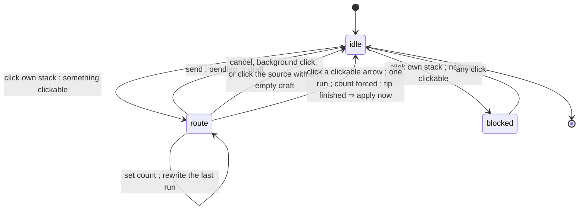

# count-after-route — name the route, then say how many heads walk it

**Packet:** [P35 — Ask the count after the route, and off the board](../../design/packets/P35-count-after-route.md)
**SPEC:** §3 allowance (read), §5 sentries (read). **No SPEC.md edit.**
**Layer:** `packages/web` only. Does not touch `rules-core`, contracts DTOs, `Move`, or ADR 0002.
**Features:** [core](./count-after-route.core.feature) ·
[edge cases](./count-after-route.edge-cases.feature)

## Purpose

P34 replaced destination-picking with route-drafting and was only ever driven
with a mouse at desktop width. On a phone the model reads badly, and all three
complaints are the same mistake: **the carry is asked for before the route it
has to pay for.**

Distance is bought with heads (§3). So the *floor* on a run's count is a
function of how far that run goes — which is unknown until the player has said
where they are going. Asking for the count first asks the player to budget for
a trip they have not described, and then shrinks the offer according to that
guess.

This feature inverts the order. A click names a run. **Then** the count for
that run is offered, floored at what the run costs and capped at the heads
standing where it began. When the count has only one legal value and the route
can go no further, the click applies the move and no control appears at all.
And the control leaves the board, because a panel anchored at the tip covers
the arrows it is asking about.

## What changes, precisely

Three behaviours, one layout move.

1. **A run is drafted at full strength.** `extend` no longer reuses
   `phase.carry` for the new run's moves; it uses **every head standing on the
   tip**. The rays were already painted at that strength, so the run the player
   clicked is the run they saw.
2. **The count control edits the run just drafted.** `setCarry` stops meaning
   "the count the *next* run will use" and starts meaning "rewrite the count of
   the **last** run". Earlier runs are immutable, as in P34.
3. **Nothing to decide, nothing to click.** A click that produces a
   single-run draft whose count has exactly one legal value and whose tip
   offers nothing clickable **applies immediately**.
4. **The control docks below the board** instead of floating at the tip.

### Why editing the last run is the whole feature

P34 already gave each run its own count, frozen once drafted
(*"Lowering the carry mid-route leaves earlier moves alone"*). The only thing
wrong was **when** the player was asked. Moving the question after the click
therefore needs no new model — it needs the count to address the run behind it
rather than the run ahead of it.

That also means **mid-route splitting survives untouched**, which the first
draft of this packet wrongly expected to lose. Draft a run carrying 8 of 12,
extend, and the second run's count defaults to the 8 that arrived — lower it to
4 and 4 stay at the junction as a sentry (§5). Two sentries, one route, no
extra gesture.

### The floor is measured, never derived

The least count for a run is the least count for which **every step of that
run** validates under `rules.apply` on the scratch state at the run's start.
It is *not* computed from `speed(N) = 1 + floor(log₂ N)`. Two derivations of
one number is how the two copies come to disagree, and the engine is the one
that decides.

`offerableCarries` measures one hop from the tip; this feature needs a whole
run, so it is replaced by **`runCarries`** — the ascending counts that walk the
last run end to end. With an empty draft there is no last run and the list is
empty, which is exactly why no control is drawn before a destination exists.

## Phase state

`RoutePhase` keeps `from`, `tip`, `draft`, `tipHeads` and `offer`. Two changes:

- **`carry` is redefined** as *the count on the last drafted run* — no longer a
  value carried forward across runs. Undefined in meaning with an empty draft;
  the invariants below pin it to the tip's head count there so nothing reads a
  stale number.
- **`lastRunLength: number` is added** — how many of `draft`'s trailing moves
  the last click appended, `0` for an empty draft. This is what lets the count
  control rewrite exactly one run: drop the trailing `lastRunLength` moves,
  re-emit them with the new count, rebuild. Storing the boundary beats
  re-deriving it, because a run is defined by the click that made it and
  nothing in a flat `Move[]` records where a click ended.

`offer.carries` changes meaning with `carry`: legal counts for the **last run**,
ascending, empty with an empty draft.

## The flow

The last two `route --> idle` edges are the same click reaching two different
ends. Which one fires is decided entirely by the three-part test below.

## Auto-apply — the exact test

A click applies immediately when **all three** hold of the state it would
produce:

1. the draft is **exactly one run** (`lastRunLength === draft.length`), and
2. that run's count has exactly **one** legal value (`carries.length === 1`), and
3. the new tip offers **nothing** clickable (`clickable.size === 0`).

All three are load-bearing:

- **One run.** A multi-run draft is a route the player has been building; taking
  Send, Cancel and pop away from them at the last click would be a surprise
  even when the last leg had no decision left in it. The narrow rule covers the
  two cases the human named — a single head walking one step, and a `2^k` stack
  walking exactly `k+1` steps — and nothing else.
- **Count forced.** With two or more legal counts there is a choice to offer.
- **Tip finished.** With something still clickable the route may continue, and
  applying would cut it short.

An auto-applied click leaves `pending` holding the run's moves and the phase
`idle`, identical to a click followed by Send. There is **no** confirm step and
no chrome frame in between.

**The cost, accepted here.** Selecting a stack is still a separate, free,
reversible tap, but the second tap is now unrecoverable for these cases — there
is no in-turn undo in the game (its own packet). This restores the rule P31
already shipped (*"unique-portion trips … get a confirm when the unique count
is greater than 1"*), which P34 regressed by rendering the tip panel on
`phase.kind === 'route'` alone.

## The docked strip

The count stepper, Send and Cancel move out of the board into a fixed strip
**below** it — a sibling of `.stage` inside `.app`, not a child of the stage.

- **It never overlaps a clickable arrow**, at any viewport. That is the point:
  the tip-anchored panel overlapped 4 of the 12 clickable arrows at desktop
  width, and on a 375 px viewport anything anchored at the tip covers part of
  the offer it is asking about. Relocating the rectangle would move the
  problem; leaving the board retires it.
- **The tip keeps its halo**, which is what carries the spatial link once the
  control is no longer touching it.
- **One code path for touch and mouse.** Below the board is thumb reach on a
  phone and unremarkable on a desktop, so no pointer-type branch is needed.
- **It is absent with an empty draft** — there is no run to count.
- Changing the count still repaints live, which is how a player learns that
  distance is bought with heads (§3). The ray's painted length stays the only
  display of how far a count reaches; no numeral competes with it.

## Paint

Unchanged from P34 except that the rays are now always measured at the tip's
**full** head count, never at a lower carry chosen in advance. Lowering the
count of the last run still shortens what is offered *from the new tip*,
because fewer heads arrived there.

## Invariants (EARS)

1. While the draft is empty, the adapter shall render no count control.
2. While the draft is empty, `offer.carries` shall be empty.
3. When a run is appended, the adapter shall set that run's count to the heads
   standing on the tip the run started from.
4. The rays offered from a tip shall be measured at that tip's full head count.
5. `offer.carries` shall list exactly the counts for which every step of the
   last run is accepted by `rules.apply`, ascending.
6. `offer.carries` shall never contain a count exceeding the heads standing on
   the arrow the last run started from.
7. When the count of the last run is changed, the adapter shall leave every
   earlier run's moves byte-identical.
8. When the count of the last run is changed, the adapter shall re-emit exactly
   `lastRunLength` moves.
9. Where a count is not in `offer.carries`, the adapter shall ignore the request
   to set it.
10. When a click yields a one-run draft with one legal count and an empty
    clickable set, the adapter shall apply the draft without rendering a control.
11. When a click yields a draft failing any of those three conditions, the
    adapter shall render the control and apply nothing.
12. An auto-applied click shall place in `pending` exactly the moves a click
    followed by Send would have placed.
13. While the match is over or input is locked, the adapter shall render no
    count control.
14. The docked strip shall not intersect any arrow in the clickable set at
    viewport widths 375, 768 and 1280.
15. Send shall emit the draft in order regardless of how many runs it holds.
16. Cancel and a background click shall leave the game state unchanged.
17. `lastRunLength` shall equal `0` if and only if the draft is empty.
18. `lastRunLength` shall never exceed `draft.length`.
19. After a pop to a walked arrow, `lastRunLength` shall describe the run that
    ends at that arrow.
20. Equal inputs shall produce an equal offer, an equal paint and an equal
    auto-apply verdict.
21. `route.ts` shall reference neither a clock nor a random source.

## Out of scope

- In-turn undo (see *the cost, accepted here*).
- Hover preview, already gated on `pointer: fine` and therefore absent on
  touch. No touch equivalent is added.
- Any change to what a route may legally be, or to `speed(N)`.
- Bot move generation and P30 playback pacing.
