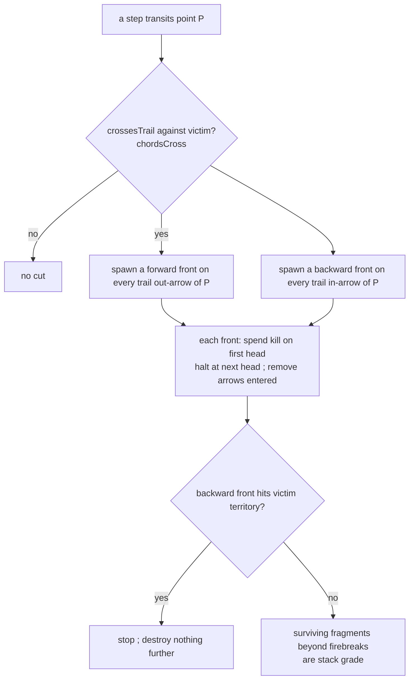

# cuts — evaporating a trail from a crossing

**Packet:** [P06 — Cuts, evaporation & contact combat](../../design/packets/P06-cuts-combat.md)
**SPEC:** §6.1 (cutting a trail), §6.1a (all-to-all, headless trail), §2 (chord test),
§11 items 24, 26, 27, 28
**Features:** [core](./cuts.core.feature) · [edge cases](./cuts.edge-cases.feature)
**Sibling:** [combat](../combat/combat.md) — contact on an enemy-occupied arrow
**Builds on:** [crossings](../crossings/crossings.md) — P05's `crossesTrail` query

## Purpose

P05 reported whether a traversal crossed a trail. This file is what that report
**costs**: the victim's trail evaporates in both directions from the cut point,
one kill per front, until a firebreak or territory stops it.

## Scope

In: cut trigger on a step, bidirectional evaporation, all-to-all branch spread,
per-arrow halt, territory wall, demotion of surviving fragments, headless trail
left ordinary.

Out: **contact combat** — [combat](../combat/combat.md). **Conversion** — P07
(§6.3); a demoted fragment inside enemy ground keeps its heads standing here.
**Closure / fill** — P05b; a cut mid-closure is an interaction (trail gone, no
claim) but fill is not reopened.

Tests run on the **P02 fixture boards**. Cuts are local.

## Terms

| Term | Means |
|---|---|
| **cut** | a step whose traversal crosses a victim's trail (`chordsCross`) |
| **cut point** | the point the traversal transits — `target(from)` |
| **front** | one advancing edge of evaporation; carries exactly one kill |
| **firebreak** | the head a front halts at — the *second* one it meets |
| **region** | trail between two firebreaks, or a firebreak and territory; what one cut destroys |
| **demotion** | surviving fragment beyond a firebreak loses its territory anchor → stack grade |

*trail*, *crossing*, *grain*, *point*, *anchor grade* keep their earlier meanings.

## How a cut resolves

**Order with combat.** When the same step is also contact combat (destination
holds an enemy group), resolve **combat first**, then this cut against the trail
set — trail is independent of heads (§6.1a). See [combat](../combat/combat.md).

## Invariants

- When a step's traversal crosses a victim's trail, the system shall evaporate
  that trail in both directions from the cut point.
- The system shall give each evaporation front exactly one kill, spent on the
  first head the front meets, and shall halt at the next head.
- At a point where the victim's trail has more than one continuation in a front's
  direction, the system shall send a front into every continuation.
- The system shall halt a front per arrow (on the arrow being entered), never by
  a head on another arrow of the same point.
- When a backward front reaches the victim's own territory, the system shall stop
  and destroy nothing further.
- The system shall remove destroyed arrows from the victim's trail only.
- When a cut removes the territory-side region, the system shall leave surviving
  fragments at stack grade rather than destroying them.
- The system shall leave a headless stretch after a mid-trail cut as ordinary
  trail (no cleanup pass).
- The system shall not mutate the input state, and shall return equal outputs for
  equal inputs.
- The system shall enumerate no vertex.

## What this file deliberately does not decide

- **Contact combat losses** — [combat](../combat/combat.md).
- **Whether enclosed heads convert** — P07 (§6.3).
