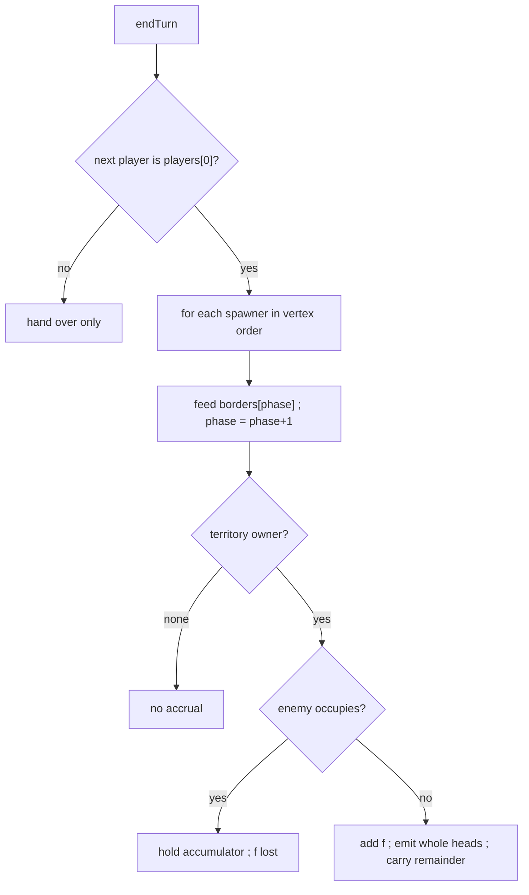

# economy — spawner accrual and accumulators

**Packet:** [P08 — Spawner economy](../../design/packets/P08-spawner-economy.md)
**SPEC:** §7 (spawner logic), §11 items 13–15, 18, **41**
**Features:** [core](./economy.core.feature) · [edge cases](./economy.edge-cases.feature)

## Purpose

Territory pays. Authored spawners feed bordering arrows through exact-rational
accumulators once per **full round**.

## Scope

In: RR tick on full round, carry remainder, reset on capture, enemy blockade,
friendly merge without merge override, double-fed arrows.

Out: placement table / *R* / *N* (P09), victory (P09). Birth onto a *foreign*
open trail is a cut — [birth-cut](../birth-cut/birth-cut.md) (P40), not this
packet.

## Terms

| Term | Means |
|---|---|
| **full round** | `endTurn` returns active seat to `players[0]` |
| **force** | rational *f* ≤ 1/3 on a spawner |
| **phase** | RR cursor into sorted `borderArrows(vertex)` |
| **blockade** | enemy head on the feed arrow — *f* lost, accumulator held |

## Flow

## Invariants

- When a full round closes, the system shall advance every spawner's round-robin
  exactly one step.
- When the feed arrow is owned and not enemy-occupied, the system shall add the
  spawner's force to that arrow's accumulator exactly.
- When an accumulator reaches or exceeds 1, the system shall emit whole heads for
  the territory owner and carry the fractional remainder.
- When a spawn merges into a friendly stack, the system shall not set a merge
  override.
- When an enemy occupies the feed arrow, the system shall neither advance that
  accumulator nor spawn onto it for that tick.
- When an arrow's territory owner changes, the system shall reset its accumulator.
- The system shall use exact rational arithmetic only.
- The system shall not mutate the input state; equal inputs yield equal outputs.
