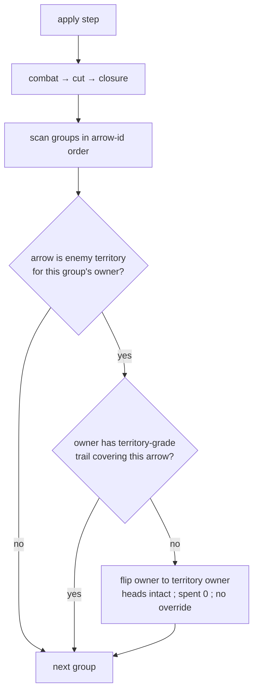

# encirclement — conversion inside enemy territory

**Packet:** [P07 — Territory & encirclement](../../design/packets/P07-territory-encirclement.md)
**SPEC:** §6.3, §6.1 (anchor grades), §7 (closure seam), §11 items 9, 28, **40**
**Features:** [core](./encirclement.core.feature) · [edge cases](./encirclement.edge-cases.feature)
**Upstream:** [closure](../closure/closure.md) claims tiles; [cuts](../cuts/cuts.md) demote grade

## Purpose

P05b claims tiles and leaves enemy heads standing. This packet flips them when
the §6.3 predicate holds:

> An enemy head inside your territory with no **territory-grade** anchored trail
> is encircled, and converts.

## Scope

In: the state predicate, intact stack conversion, reset of `spent` / override,
order after combat → cut → closure, head conservation, grade shields, neutral
vs enemy stranded.

Out: accumulators (P08), victory (P09), trail stripping (cuts own that), combat
modifiers (item 39 parked).

Tests that need a fresh enclosure run on the **tiling**. Local grade cases may
use fixtures when territory is authored.

## Terms

| Term | Means |
|---|---|
| **encircled** | standing on another player's territory without territory-grade trail |
| **convert** | ownership flips to the territory owner; heads unchanged; spent 0; no override |
| **territory grade** | trail connected to the owner's own territory (§6.1) |
| **stack grade** | trail anchored only on a stack — does **not** protect |

## How conversion resolves

## Invariants

- When a group stands on another player's territory and lacks territory-grade
  trail for its owner, the system shall convert it to the territory owner with
  the same head count.
- The system shall reset `spent` to 0 and drop any merge override on convert.
- The system shall not convert a group whose trail is territory-grade for its owner.
- The system shall not convert a group on neutral ground or on its own territory.
- The system shall not let stack-grade or dormant trail protect inside enemy territory.
- When conversion runs, the system shall conserve total heads on the board for
  that pass.
- The system shall run conversion after combat, cut, and closure within one `apply`.
- The system shall not strip the victim's trail as part of conversion.
- The system shall not mutate the input state, and shall return equal outputs for
  equal inputs.
- The system shall enumerate no vertex.

## What this file deliberately does not decide

- **Accumulator reset on owner change** — P08.
- **Elimination / victory** — P09.
- **Territory combat modifiers** — §11 item 39.
- **Self-walk-in onto foreign territory** — P28 / §11 item 43 makes that step
  **illegal** rather than converting. The predicate here still runs on groups
  that become encircled on *another* player's apply.
