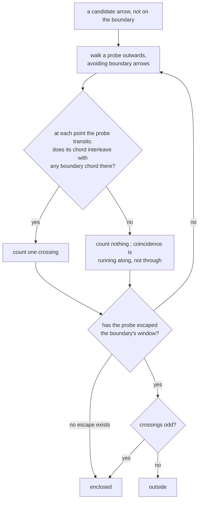

# fill — what a closed curve contains

**Packet:** [P05b — Closure, fill & land bridges](../../design/packets/P05b-closure-fill.md)
**SPEC:** §7 (*even-odd is correct here because the board is a plane*, self-crossings
invert), §2 (the plane, the chord test), §6.1a invariant 3, §11 items 4, 16, 30
**Features:** [core](./fill.core.feature) · [edge cases](./fill.edge-cases.feature)
**Sibling:** [closure](../closure/closure.md) — which arrows the curve *is*
**Builds on:** [chord-test](../chord-test/chord-test.md) and
[crossings](../crossings/crossings.md) — the predicate and the extraction, unchanged

## Purpose

**This is the subtlest logic in the game**, and the one place where a
wrong-but-plausible implementation produces a wrong answer rather than a crash.
§6.1a says so outright:

> This is why fill must read the arrow set and never the move list. Under a
> re-tracing prohibition that was automatic. It is now an assertion, and it is the
> one place where getting the representation wrong would silently produce a wrong
> answer instead of a crash.

[closure](../closure/closure.md) hands this file a **closed curve** — the arrows the
backward walk claimed, with the mover's own territory at both ends. This file answers
one question about it: *which arrows are inside?*

## Scope

In: even-odd parity over arrows, the escaping probe, the crossing test, and the bound
on how far the sweep looks.

Out: **which arrows form the curve** — [closure](../closure/closure.md). **What
being inside grants** — also closure, and P07 for the heads standing there. This file
is a pure query: given a boundary and a board, which arrows are enclosed.

**Tests run against the generated tiling and cannot run against a fixture.** That is
a theorem, not a preference — see below.

## Terms

| Term | Means |
|---|---|
| **the boundary** | the arrows [closure](../closure/closure.md) claimed, together with the chords they present at every point (§2). A closed curve, because the walk reached territory at both ends |
| **candidate** | an arrow that is not on the boundary, and whose side is being decided |
| **probe** | a walk of arrows from a candidate that escapes the boundary's reach |
| **crossing** | a point where the probe's chord and a boundary chord **interleave** |
| **enclosed** | a candidate whose probe crosses an odd number of times |
| **escapes** | leaves a window big enough that no further crossing is possible |

*point*, *slot*, *chord*, *interleave* keep their [chord-test](../chord-test/chord-test.md)
meanings. *straight-ahead* is §2's: arrive on slot `s`, leave on slot `s + 3`.

## Even-odd, in three parts

**Why the plane is load-bearing.** §7: a ray escapes to infinity and crosses the
boundary an odd number of times exactly when the tile is inside — the classical
Jordan argument, and *it needs the ray to leave*. On a torus every lattice ray is a
closed loop, so its mod-2 intersection number with a contractible curve is zero and
even-odd reports **outside for every tile of every enclosure** (§11 items 4 and 30).
That is what withdrew the torus, and it is what makes this the first packet a fixture
board cannot host: a fixture is finite, and *straight-ahead* is a bijection on a
finite board, so every ray closes there too.

**Why the crossing test is `chordsInterleave` and never `chordsCross`.** Coincidence
means the probe and the boundary share an arrow at that point — the probe is running
*along* the curve, not through it, which is the degenerate ray every even-odd
implementation has to handle. §6.1a puts it in terms of the game: re-traversing an
arrow the trail already holds leaves the set unchanged, so there is nothing for
parity to flip. [crossings](../crossings/crossings.md) shipped both predicates
separately for exactly this caller.

**Why the probe does not have to be straight.** Parity is a topological invariant: two
paths from the same candidate to infinity differ by a closed loop, and a closed loop
crosses a closed curve an even number of times. So the probe may **route around**
boundary arrows rather than perturb coordinates it does not have — `GeometryPort`
exposes none by design. Straight-ahead is the natural default and the only direction
notion on the port; when it would run along the boundary, another route gives the
same answer. A candidate with *no* escaping route is enclosed, which is the right
answer and needs no rule.

## The boundary is the claim, not the trail

A dangling arm is not part of the boundary, and this is not an optimisation.

Even-odd is only defined against a **closed** curve. A dangling arm is a slit: a
probe can cross it and come back, so parity against a curve containing one is not
path-independent and the answer would depend on which probe was chosen. That is why
[closure](../closure/closure.md)'s backward walk runs *first* — it does not merely
decide what is claimed, it produces the only object this file can be asked about.

Two consequences worth stating:

- **A land bridge never reaches this file.** Its walk dead-ended, so there is no
  second end, no closed curve and no parity — §7 says it encloses nothing, and the
  reason is that the question is not askable rather than that the answer is empty.
- **An unclaimed arm cannot leak the fill.** It is trail, it is not boundary, and its
  arrows are ordinary candidates like any other.

## Bounded by the trail, never by the board

§7: *fill is bounded by the trail, not by the board. A trail of L arrows cannot
enclose more than `O(L²)` of them, so the sweep is finite even though the board is
not — and it is the only place the engine ever needs a bounded region of an unbounded
lattice.*

So the sweep's `window()` radius is derived from the claimed path's own size, and the
derivation lives in **one** place with its bound stated. A window one step too small
is a silently wrong answer, which is this file's whole failure mode.

## Invariants

- The system shall report a candidate enclosed when an escaping probe crosses the
  boundary an odd number of times, and outside when it crosses an even number.
- The system shall count a crossing only where the probe's chord and a boundary chord
  interleave, and never where they merely coincide.
- The system shall report the same verdict for every escaping probe from the same
  candidate.
- The system shall report a candidate enclosed when no escaping probe exists.
- The system shall test the probe against every chord the boundary presents at a
  point, not only the first.
- When the boundary passes through one point more than once, the system shall report
  the parity that inversion produces, and shall need no special case for it.
- The system shall report every arrow of a region enclosed, and no arrow outside it.
- The system shall report nothing enclosed for a boundary that is not closed.
- The system shall bound its sweep by the boundary's own extent and shall read no
  board extent.
- The system shall derive every chord through `slotOf`, and shall infer no slot from
  an arrow identifier.
- The system shall enumerate no vertex.
- The system shall return equal results for equal inputs, whatever order the boundary
  set was built in, and shall change no state.

## What this file deliberately does not decide

- **Which arrows are the boundary** — [closure](../closure/closure.md). Handing this
  file the whole trail instead of the claim would give it an open curve and an
  undefined answer.
- **What happens to what is inside** — closure claims the tiles, P07 converts the
  heads.
- **How the sweep is implemented.** Per-candidate probes and a single outward parity
  sweep give the same answer; the invariant *the same verdict for every escaping
  probe* is what makes them interchangeable, and it is asserted rather than assumed.
