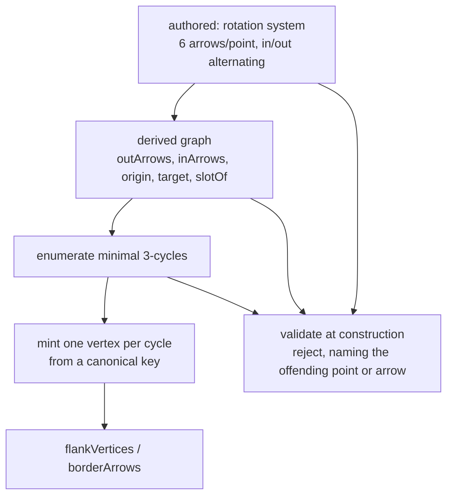

# fixtures — hand-authored boards behind the same port

**Packet:** [P02 — Fixture geometry](../../design/packets/P02-fixtures.md)
**SPEC:** §2 (the board, orientation pattern), §7 (specials live on vertices), §11 items 4, 29
**Features:** [core](./fixtures.core.feature) · [edge cases](./fixtures.edge-cases.feature)

## Purpose

A second `GeometryPort` implementation, over a **hand-authored finite digraph**
instead of the generated lattice. It exists for two reasons the tiling cannot
serve on its own:

- **It makes "any implementation of the port is interchangeable" a demonstrated
  fact rather than an aspiration.** One implementation cannot show that; a second
  one, held to the identical conformance suite, is the whole point of the port.
- **It gives the rules packets a board a failing test can print.** The tiling is
  unbounded and its ids read like `tiling:p:-3,7`; when a *rules* test fails on it
  you cannot see the shape of what went wrong. A 7- or 8-point board fits in the
  failure output.

This is the sibling of [tiling](../tiling/tiling.md): same port, same
[conformance suite](../geometry-port/geometry-port.md), authored rather than
generated. Everything the suite already pins is inherited unedited; this spec owns
only what is peculiar to *authoring* a board — construction, validation, and the
one thing a finite board fundamentally cannot do.

## Scope

Two boards ship, `minimal` and `spacious` (see Terms). Both satisfy the
conformance suite — **37 assertions, unedited.** Editing one is not a fix; it is
evidence the port leaked something concrete, and that is the finding to report.

What is **not** here: any rule; any coordinate or layout (an abstract board has no
positions — §11 item 29, P03 D3); and, structurally, anything that needs
inside-versus-outside. See *What a fixture cannot host*.

## Terms

| Term | Means |
|---|---|
| **rotation system** | the authored data: for each point, its six arrows in cyclic slot order, alternating in/out |
| **derived vertex** | a spawner vertex the port *computes* — one per minimal directed 3-cycle — rather than one that is authored |
| **canonical key** | the name a derived id is minted from — a cycle's three arrow names, sorted — so two builds agree exactly |
| **`minimal`** | the 7-point board; the tournament on ℤ/7. Every point adjacent to every other (`K₇`) |
| **`spacious`** | the 8-point board `⟨(4,0),(1,2)⟩`, undirected diameter 2; the smallest conformant board with a non-adjacent pair |
| **diameter** | the largest graph distance between two points; a finite-board notion, invisible through the port |

*point* and *vertex* remain different objects, exactly as in
[geometry-port](../geometry-port/geometry-port.md): a head stands on arrows and
moves through points, never on a vertex.

## The construction

A board is authored as one line per point — its six arrows in slot order — and
**everything else is derived.** The vertex lattice in particular is *not* authored:
on any conformant board each minimal directed 3-cycle carries exactly one vertex,
so `flankVertices` and `borderArrows` come from enumerating cycles, not from a
second input.

Authoring the vertices would be fourteen more lines of chances to be wrong, and it
would hide that §7's vertex lattice is a **consequence** of the arrow graph rather
than a second fact about the board. What genuinely cannot be derived is the cyclic
*order*: alternation fixes the pattern in/out/in/out/in/out, but **which** in-arrow
sits between **which** out-arrows is free (§11 item 29), and that free choice is
exactly what the chord test reads. So a fixture is a graph *plus a rotation
system*, and the rotation system is rules data, not presentation.

Boards are **not** authored as lattice quotients, even though both shipped boards
happen to be quotients of the real tiling. Writing `⟨(7,0),(2,1)⟩` would make the
fixture a second copy of [tiling](../tiling/tiling.md)'s arithmetic — the two
implementations would then share any mistake, and the suite would stop being
evidence of anything.

## Invariants

- The system shall satisfy every assertion in the `GeometryPort` conformance
  suite, unedited, for each shipped board.
- The system shall derive exactly one vertex per minimal directed 3-cycle, and no
  vertex from anything else.
- The system shall mint every derived identifier from a canonical key over its
  arrows, so that two ports built from the same description return identical ids.
- When a board description does not alternate in-arrows and out-arrows at some
  point, the system shall raise a contract violation at construction.
- When a board description names an arrow whose origin or target is not a declared
  point, the system shall raise a contract violation.
- When a board description places an arrow in the rotation of a point that is not
  one of that arrow's endpoints, the system shall raise a contract violation.
- When a board description contains a self-loop, a parallel pair, or a directed
  2-cycle, the system shall raise a contract violation.
- When a board description puts a point on other than six minimal cycles, or an
  arrow on other than two, the system shall raise a contract violation. (These are
  the point-side and arrow-side of SPEC §2's 3:1:2 incidence; on a realizable
  board they co-occur.)
- The system shall raise a contract violation naming the offending point or arrow —
  and every such fault it finds, not only the first — rather than merely reporting
  that the board is non-conformant.
- When given a radius at least the board's diameter, the system shall return the
  whole board as the window.
- The system shall reject any identifier minted against any other board, including
  another fixture and the tiling.
- The system shall expose no board extent, size or diameter through
  `GeometryPort`.
- The system shall order every returned sequence by authored or canonical order,
  never by insertion into a map.

## What a fixture cannot host — and why that is a theorem, not a gap

Even-odd fill (§7) casts a ray and counts trail crossings mod 2. Through the port
a ray needs no coordinates: arrive at a point on slot `s`, leave on the opposite
slot `s + 3`. Alternation (§11 item 29) makes `s + 3` an out-slot whenever `s` is
an in-slot, so the ray always continues, and *straight-ahead* is a well-defined map
from arrows to arrows.

That map is a **bijection on arrows**. On a finite board every orbit of a bijection
is a cycle, so **every ray is a closed loop and every mod-2 crossing count is
zero** — fill reports *outside* for every cell of every enclosure.

This is SPEC §11 item 4's argument with the torus removed from it. Item 4 read as
being about *wrapping*; it was never about wrapping, it was about **finiteness**,
and the torus was merely the finite board we happened to be holding. The
consequence for this packet is exact:

| Rules a fixture can host | Rules only the tiling can host |
|---|---|
| movement, stacks, the turn loop (P04) | closure and fill (P05) |
| crossings, the chord test, branch anchors (P05) | encirclement and conversion (P07) |
| cuts, evaporation, combat (P06) | |
| spawner accrual, shares, blockades (P08) | |

Most of the rules surface is local and lives in the left column. What sits on the
right is **not deferred — it is impossible on any finite board**, and no authoring
choice changes that. P05's closure half and P07 test against the tiling, which is
correct there anyway: the plane is where fill is defined. The readable-failure debt
they take on is paid back by a window printer, deferred to P05 (P02 D4).

The edge cases turn this into one executable scenario — every straight-ahead ray
returns to itself — because the limit is invisible and expensive, and a spec that
merely asserts it in prose leaves the next author to rediscover it.

## Why the floor is 7, not 6

§11 item 29 estimated "near 6 points and 18 arrows" by counting. It is one point
short: no-rim forces undirected degree 6 at every point, and with no parallel
arrows that needs **at least 7 points**. Seven is attained, by a board unique up to
isomorphism — the tournament on ℤ/7, arrow `i → j` iff `j − i` is a square mod 7.
Brute-forced over every lattice quotient to 30 points: nothing below 7 satisfies
the suite. That unique smallest board is `K₇`, every point adjacent to every other,
which is why `spacious` exists — on `minimal` no test can say "not adjacent" or
"outside the window".
