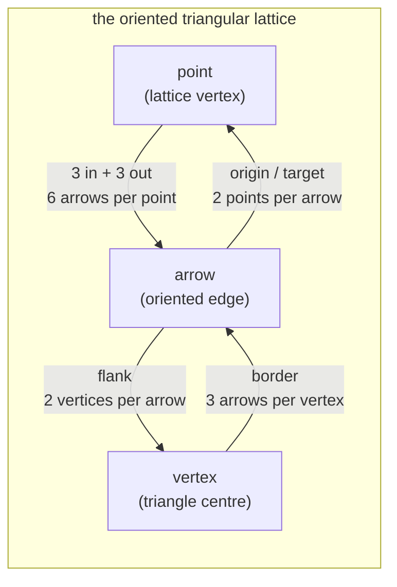

# geometry-port — the arrow graph behind a port

**Packet:** [P01 — Contracts](../../design/packets/P01-contracts.md)
**SPEC:** §2 (the board), §7 (specials live on vertices)
**Features:** [core](./geometry-port.core.feature) · [edge cases](./geometry-port.edge-cases.feature)

## Purpose

`GeometryPort` is the only thing the rules core knows about the board. Every
scenario here must pass for **any** implementation — the hand-authored fixture
boards of P02 and the generated tiling of P03 alike.

That is not a stylistic preference. Rules packets test against small boards with
known adjacency, which make a failure readable in a way the unbounded lattice
never will, and the generated board answers the same suite. A conformance suite
two implementations both satisfy is what makes that possible, and it is the reason
geometry is a port rather than a constant table.

The port **outlived the reason it was introduced**, which was that SPEC §11
item 1 had not been measured. It is now resolved — alternating — and P03
generates rather than measures. The port stays because readable fixtures are
worth having on their own.

**Nothing in these scenarios may name a coordinate, a distance, or a board
extent.** If a scenario needs one it belongs in that implementation's own suite.

## Everything is asserted over a window

SPEC §11 item 4 made the board the **unbounded lattice**, so there is no "every
point" to quantify over and `allPoints()` and its siblings are gone. Enumeration
is `window(centre, radius)`, a **graph-distance ball** — a notion definable from
adjacency alone, so it means the same thing on a generated lattice and on an
abstract fixture digraph. A fixture small enough is simply its own window.

Two things follow, and the second is the more interesting one:

- A window is **inclusive at the fringe in one direction only**: every arrow
  touching a window point is in the window, and every vertex flanked by a window
  arrow is in it. The converse does not hold — a fringe arrow may point out of the
  window — and no scenario may assume it does.
- **Every invariant below is local.** That was always true and the finite board had
  been hiding it: `3:1:2` was stated as a global count when it is really "every
  point owns three arrows and lies on six minimal cycles". Restating it locally
  cost nothing and made the assertion sharper, because a global count can be right
  on average while being wrong everywhere.

## Terms

| Term | Means |
|---|---|
| **arrow** | one tile; a node in the movement graph; an oriented lattice edge |
| **point** | a movement junction, 3 arrows in and 3 out; a lattice vertex |
| **vertex** | a pinwheel centre bordered by 3 arrows; a triangle centre; *never occupied* |
| **flank** | the relation from an arrow to the two vertices on its left and right |
| **border** | the relation from a vertex to its three arrows; the inverse of flank |
| **girth** | the length of the shortest directed cycle |

*point* and *vertex* are different objects. A head stands on arrows and moves
through points; it can never stand on a vertex, which is precisely what makes
"does standing on a spawner count?" structurally impossible to ask.

## The structure being asserted



The incidence counts close and fix the ratio:

```
6P = 2A  →  A = 3P
3V = 2A  →  V = 2P

arrows : points : vertices  =  3 : 1 : 2
```

On an unbounded board those are **densities, not counts**, so the suite asserts
the two local facts that imply them:

```
every point owns 3 out-arrows, and no other point does   →  A = 3P
every point lies on exactly 6 minimal cycles             →  C = 6P/3 = 2P
every minimal cycle holds exactly 1 vertex, and back     →  V = C = 2P
```

The middle line is the one worth knowing: **the six minimal cycles through a point
are the six triangles it corners**, and under the alternating orientation every
one of them circulates. Neither the ratio nor the size of the board is needed to
check it.

## Invariants

- The system shall report exactly 3 in-arrows and exactly 3 out-arrows for every
  point.
- The system shall report an arrow among the out-arrows of its origin and among
  the in-arrows of its target.
- The system shall report exactly 3 bordering arrows for every vertex.
- The system shall report exactly 2 distinct flank vertices for every arrow.
- The system shall keep flank and border mutually inverse.
- The system shall report exactly `3·|points|` arrows whose origin lies in a
  window.
- The system shall place every point on exactly 6 minimal directed cycles.
- The system shall enclose exactly one vertex within every directed 3-cycle, and
  shall give every vertex exactly one such cycle.
- The system shall make every point in a window reachable from every other by
  forward movement alone.
- The system shall have girth exactly 3.
- The system shall enumerate each point, arrow and vertex of a window exactly once.
- When given a radius that is negative or not an integer, the system shall raise a
  contract violation.
- The system shall yield only the centre for a window of radius 0, and shall grow
  monotonically with radius.
- The system shall assign each of a point's six arrows a distinct slot.
- The system shall alternate in-arrows and out-arrows around every point's six
  slots.
- While enumerating, the system shall yield a stable order for equal inputs.

**The phase of the alternation is not asserted, deliberately.** In-arrows may hold
the even slots or the odd ones (SPEC §11 item 29). Slot indices are this port's
own labelling and the chord test is rotation-invariant, so pinning the phase would
create a fact for a caller to depend on and buy nothing. An implementation that
needs a particular phase has misread the chord test.

## Why these and not more

Every invariant above is a sentence in SPEC §2 or §7, not an inference. Two that
look like nice-to-haves are load-bearing and worth naming:

**Strong connectivity** is what allows movement to be forward-only with no
backwards escape hatch and no reachability special case. It follows from
3-in/3-out: a balanced, weakly connected digraph is Eulerian, therefore strongly
connected. The same degree condition independently makes self-trap impossible
(§6.1a) — balance pays twice.

**Girth 3 enclosing exactly one vertex** means the atomic unit of conquest and
the atomic unit of value are the same object. The smallest territory the board
permits holds exactly one spawner, which is what makes the drafted opening
affordable (Appendix A) and what sets the whole scale of the economy.

It used to be the invariant that **constrained board size** — the smallest torus
satisfying this suite was 4×4, because wrap collapsed or manufactured triangles
below that. **SPEC §11 item 4 removed the wrap and with it the floor**: on the
unbounded lattice the property is local and holds unconditionally. What survives
is the reason P02 authors abstract digraphs rather than lattice sub-boards — the
smallest conformant graph is **7 points, 21 arrows, 14 vertices** (the tournament
on ℤ/7, unique up to isomorphism), and a fixture you can read is the entire point
(§11 item 29).

## Stable ordering is a determinism requirement

The last invariant is not tidiness. Even-odd fill (§7) sweeps a region of the
board through this port, and combat resolution walks a point's arrows. A port that
returns adjacency in a different order on two calls — a `Set` iterated, a `sort`
with a partial comparator — produces a rules engine that passes every unit test and
drifts in replay. ADR 0001 names this as the realistic purity failure, not
`Math.random`.

It binds `window` hardest, because a window is built by traversal and a traversal
is exactly where insertion order leaks in. Two ports built from the same
description must return **identical** windows, element for element and in the same
sequence — not merely equal as sets.
