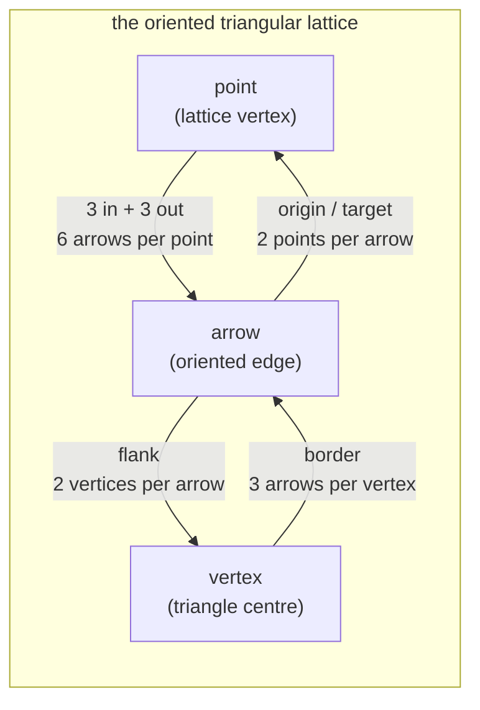

# geometry-port — the arrow graph behind a port

**Packet:** [P01 — Contracts](../../design/packets/P01-contracts.md)
**SPEC:** §2 (the board), §7 (specials live on vertices)
**Features:** [core](./geometry-port.core.feature) · [edge cases](./geometry-port.edge-cases.feature)

## Purpose

`GeometryPort` is the only thing the rules core knows about the board. Every
scenario here must pass for **any** implementation — the hand-authored fixture
boards of P02 and the generated tiling of P03 alike.

That is not a stylistic preference. SPEC §11 item 1 is still unmeasured, so the
rules have to be buildable and testable before the real tiling exists. A
conformance suite two implementations both satisfy is what makes that possible,
and it is the reason geometry is a port rather than a constant table.

**Nothing in these scenarios may name a lattice coordinate, a wrap, or a board
size.** If a scenario needs one it belongs in that implementation's own suite.

## Terms

| Term | Means |
|---|---|
| **arrow** | one tile; a node in the movement graph; an oriented lattice edge |
| **point** | a movement junction, 3 arrows in and 3 out; a lattice vertex |
| **vertex** | a pinwheel centre bordered by 3 arrows; a triangle centre; *never occupied* |
| **flank** | the relation from an arrow to the two vertices on its left and right |
| **border** | the relation from a vertex to its three arrows; the inverse of flank |
| **girth** | the length of the shortest directed cycle |

*point* and *vertex* are different objects. A head stands on arrows and moves
through points; it can never stand on a vertex, which is precisely what makes
"does standing on a spawner count?" structurally impossible to ask.

## The structure being asserted



The incidence counts close and fix the ratio:

```
6P = 2A  →  A = 3P
3V = 2A  →  V = 2P

arrows : points : vertices  =  3 : 1 : 2
```

## Invariants

- The system shall report exactly 3 in-arrows and exactly 3 out-arrows for every
  point.
- The system shall report an arrow among the out-arrows of its origin and among
  the in-arrows of its target.
- The system shall report exactly 3 bordering arrows for every vertex.
- The system shall report exactly 2 distinct flank vertices for every arrow.
- The system shall keep flank and border mutually inverse.
- The system shall satisfy `|arrows| = 3·|points|` and `|vertices| = 2·|points|`.
- The system shall make every point reachable from every point by forward
  movement alone.
- The system shall have girth exactly 3.
- The system shall enclose exactly one vertex within every directed 3-cycle.
- The system shall enumerate each point, arrow and vertex exactly once.
- While enumerating, the system shall yield a stable order for equal inputs.

## Why these and not more

Every invariant above is a sentence in SPEC §2 or §7, not an inference. Two that
look like nice-to-haves are load-bearing and worth naming:

**Strong connectivity** is what allows movement to be forward-only with no
backwards escape hatch and no reachability special case. It follows from
3-in/3-out: a balanced, weakly connected digraph is Eulerian, therefore strongly
connected. The same degree condition independently makes self-trap impossible
(§6.1a) — balance pays twice.

**Girth 3 enclosing exactly one vertex** means the atomic unit of conquest and
the atomic unit of value are the same object. The smallest territory the board
permits holds exactly one spawner, which is what makes the drafted opening
affordable (Appendix A) and what sets the whole scale of the economy.

## Stable ordering is a determinism requirement

The last invariant is not tidiness. Even-odd fill (§7) sweeps the board through
this port, and combat resolution walks a point's arrows. A port that returns
adjacency in a different order on two calls — a `Set` iterated, a `sort` with a
partial comparator — produces a rules engine that passes every unit test and
drifts in replay. ADR 0001 names this as the realistic purity failure, not
`Math.random`.
