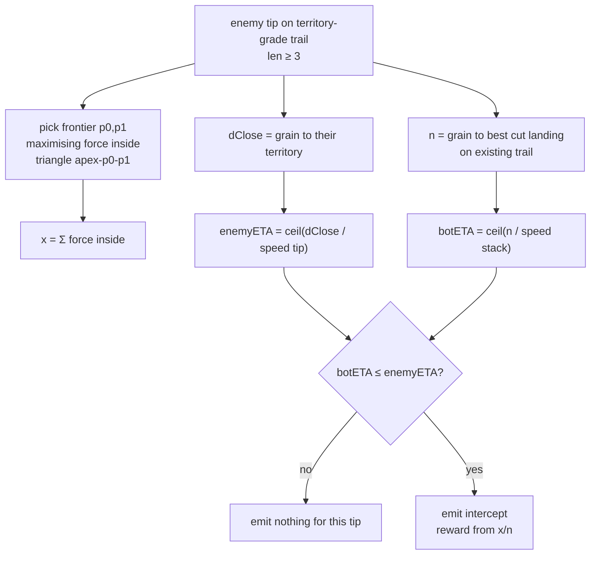

# intercept-findings — timed cuts against projected closes (P23)

**Packet:** [P23 — Intercept findings](../../design/packets/P23-intercept-findings.md)
**Layer:** web adapter (extends P21). Not a game rule.
**Features:** [core](./intercept-findings.core.feature) · [edge cases](./intercept-findings.edge-cases.feature)

## Purpose

Score steps that **race** an enemy tip’s projected return to territory: estimate
the value of the imagined frontier triangle, the enemy’s turns to land, and the
bot’s turns to cut the **existing** trail — emit `intercept` only when the bot
is in time.

## Terms

| Term | Means |
|---|---|
| **tip** | enemy arrow holding a stack on a territory-grade trail (trail length ≥ 3) |
| **apex** | `target(tip)` — the forward junction of the tip arrow |
| **frontier point** | a `PointId` incident to ≥1 arrow of that enemy’s territory |
| **imagined triangle** | apex + two frontier points `p0`, `p1` (Euclidean, tiling layout) |
| **`x`** | Σ spawner force for spawners whose vertex lies strictly inside the triangle |
| **`dClose`** | grain steps from tip to that enemy’s territory |
| **enemyETA** | `ceil(dClose / speed(tipHeads))` in enemy turns |
| **`n`** | grain steps for the bot to a legal **cut** of the existing trail |
| **botETA** | `ceil(n / speed(cuttingStackHeads))` (collector’s turn) |
| **intercept** | finding kind for an in-time approach step toward that cut |

## Flow

## v1 vs future

| v1 | Future |
|---|---|
| Cut **existing** trail only | Cut projected unlaid sides |
| `dClose` = grain tip→territory | Outside-arc along triangle sides |
| `x` = Euclidean interior force | Reachability fill if they closed |
| `x/n` clamp reward | Soften if over-chase |
| One finding pipeline | Multi-tip portfolio |

## Invariants

- WHILE collecting findings, the planner SHALL NOT call `Date.now`, `Math.random`, or I/O.
- WHEN `botETA > enemyETA` for a tip, the planner SHALL NOT emit `intercept` for that tip.
- WHEN a legal step shrinks an enemy trail this ply, the planner SHALL emit `cut` for that move, not `intercept`.
- WHEN `intercept` is emitted, its `score` SHALL equal `reward * 100 - cost * 10` with `cost = max(1, n)`.
- WHEN two findings tie on score, the planner SHALL prefer the lesser move key.
- WHILE choosing among finding kinds, the planner SHALL prefer `cut` over `intercept` over `attack` for the same move-key collision order (cuts collected first).
