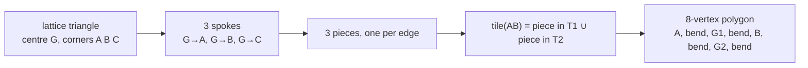

# layout — a polygon per arrow

**Packet:** [P03 — Tiling generator & torus wrap](../../design/packets/P03-tiling.md)
**SPEC:** §2 (the chevron is a decoration of a directed edge)
**Features:** [core](./layout.core.feature) · [edge cases](./layout.edge-cases.feature)

## Purpose

> **The arrow tiling, as drawable shapes.** One closed polygon per arrow, in
> lattice space, such that the polygons tile the plane exactly.

## Why this is not on `GeometryPort`

`GeometryPort` has no coordinates by construction — P01 decision D1, and the port
doc forbids a method that names a lattice coordinate. So a renderer cannot get
drawing geometry from it, and layout needs a home.

It belongs to the **tiling implementation**, not to the shared port, and §11 item
29 is why: fixture boards are abstract conformant digraphs, and **an abstract
board has no positions at all.** A layout port would be unimplementable for P02.

So the dependency runs renderer → `geometry-tiling`, which is a legal adapter →
implementation edge. The core never sees this interface.

## It is also the only check on a constant no rule can see

SPEC §2's out-directions must sum to zero *and* sit 120° apart. A set satisfying
only the first produces an isomorphic graph that passes every conformance
assertion and renders skewed. **Layout is the only executable check on that**,
which is what earns it a place in this packet rather than in P11.

## Terms

| Term | Means |
|---|---|
| **tile** | the polygon drawn for one arrow |
| **spoke** | the boundary between two tiles inside one triangle, running from the triangle's centre to one of its corners |
| **twist** | how far a spoke is rotated about the triangle centre. 0 leaves tiles as rhombi |
| **bend** | how far along the spoke the rotation is applied, as a fraction |
| **lattice space** | the coordinate system of SPEC §2's basis. The renderer owns pan, zoom and wrap copies |

## The construction

Each triangle is split into three pieces, one per edge, by a spoke to each corner.
A tile is the union of the two pieces its edge owns in its two flanking triangles.

Two rules make it tile and make it an arrow, and both were established by getting
them wrong first:

> **A spoke belongs to the (triangle, corner) pair, not to a tile.** The two tiles
> meeting along a spoke must use the identical bent path, or the plane stops being
> tiled.

> **Up and down triangles twist in opposite directions.** Twisting them the same
> way still tiles, but makes the tile centrally symmetric about its edge midpoint
> — two identical points and no arrowhead. Opposite twists give it a head and a
> tail.

So **layout needs a triangle's parity**, not just its centre. That is the one thing
it needs from the tiling that the port does not expose.

## Twist and bend are configurable and POC-grade

`twist = 87°`, `bend = 36%`, measured off the reference artwork and confirmed by
overlay. Explicitly a starting point, expected to be retuned, and held as two named
constants that nothing branches on — the same discipline SPEC §7 imposes on
spawner force. `twist = 0` degenerates to rhombi, which is a useful debugging view
and worth keeping reachable.

## Invariants

- The system shall return one closed polygon for every arrow on the board.
- The system shall return a polygon of exactly 8 vertices.
- The system shall place two of a tile's vertices at its arrow's endpoints.
- The system shall place two of a tile's vertices at its arrow's two flank centres.
- The system shall give the three tiles around a vertex a common vertex at that
  vertex's centre.
- The system shall produce polygons whose summed area equals the board's area, so
  that the tiling has neither gap nor overlap.
- The system shall produce the identical spoke path for both tiles that meet along
  it.
- The system shall degenerate to a rhombus when twist is zero.
- The system shall produce a tile that is not centrally symmetric when twist is
  non-zero.
- The system shall return polygons in lattice space, and shall not accept a
  viewport, a scale or a pixel offset.
- The system shall return the same polygon for an arrow on every call.
