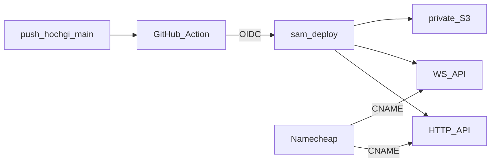

# online-infra — SAM, DNS, and CI for cheap async play

**Packet:** [P16 — Online infra](../../design/packets/P16-online-infra.md)
**ADR:** [0002](../../adr/0002-cheap-async-online.md)
**Features:** [core](./online-infra.core.feature) · [edge cases](./online-infra.edge-cases.feature)

## Purpose

Stand up the AWS edge that ADR 0002 named, on the **owner's personal account
only**, without business handlers (those are P17–P18). After this packet a
`GET` under `https://api.games.hochgi.com/conquarrow/` reaches a Lambda,
and a client can open `wss://ws.games.hochgi.com/conquarrow`. S3 exists
and is private. Deploy is `git push` to `hochgi/conquarrow` (OIDC), not
the son's Pages fork.

First-time ACM certificates and Namecheap CNAMEs are a **console checklist**,
not something the template can click for us. The template declares the custom
domains; the operator pastes ACM validation CNAMEs and the API Gateway targets
into Namecheap.

**Region** is a SAM parameter. The template's documented default is
`eu-central-1` (Frankfurt — reasonable latency from Israel). Changing it is a
deploy-time choice, not a rules change. ACM certificates for Regional API
Gateway custom domains live **in that same region**.

## Terms

| Term | Means |
|---|---|
| **HTTP API** | API Gateway HTTP API mapped at `api.games.hochgi.com` / `conquarrow` |
| **WS API** | API Gateway WebSocket API mapped at `ws.games.hochgi.com` / `conquarrow` |
| **game prefix** | S3 key prefix `conquarrow/` |
| **move Lambda** | the function P18 will fill; this packet sizes it (60s / 1024 MB) and wires IAM |
| **OIDC role** | IAM role trusted by GitHub Actions `repo:hochgi/conquarrow` |

## Flow

## Layout this packet creates

- `infra/template.yaml`
- `infra/README.md` — Namecheap + ACM + OIDC bootstrap (console)
- `packages/online-api/` — `/health` (and WS `$connect`/`$disconnect` stubs that
  write/delete `connections/…` keys or no-op until P18 fills them)
- `.github/workflows/api.yml` — path filter; **does not run on docs-only pushes**

## Invariants

- The system shall not declare resources in an employer / Versatile account.
- The system shall map HTTP routes under the base path `conquarrow` on
  `api.games.hochgi.com`.
- The system shall map the WebSocket API under the base path `conquarrow`
  on `ws.games.hochgi.com`.
- The system shall keep the match bucket private (no public ACL, no public
  policy).
- When the move Lambda is configured, the system shall set its timeout to 60
  seconds and its memory to 1024 MB.
- If a push touches none of `infra/**`, `packages/online-api/**`,
  `packages/rules-core/**`, `packages/contracts/**`, or `packages/geometry-*/**`,
  then the API deploy workflow shall not run `sam deploy`.
- The system shall trust GitHub OIDC from `hochgi/conquarrow` and shall
  not trust `shalevhoch/conquarrow` for AWS deploy.
- The system shall name S3 objects under the prefix `conquarrow/`.
