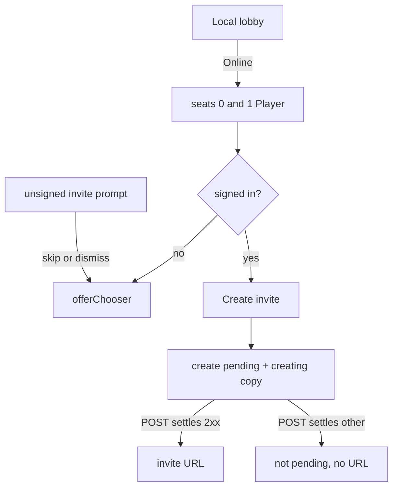

# online-lobby-followup — create wait, Player floor, Sign-In chooser

**Packet:** [P27 — Lobby follow-up](../../design/packets/P27-lobby-followup.md)
**ADR:** [0002](../../adr/0002-cheap-async-online.md) (amended 2026-08-14, P27)
**Amends:** [online-shell](../online-shell/online-shell.md) · [online-web](../online-web/online-web.md) · [online-playtest-ux](../online-playtest-ux/online-playtest-ux.md)
**Features:** [core](./online-lobby-followup.core.feature) · [edge cases](./online-lobby-followup.edge-cases.feature)

## Purpose

The second playtest minute: Create looks hung, Online still looks like a
1-human hot-seat, and dismissing GIS One Tap kills Sign-In.

Tests stay on ports, pure seat-plan helpers, and an injected GIS API. No live
Google or AWS. No jsdom. `rules-core` stays pure.

## Terms

| Term | Means |
|---|---|
| **create pending** | Host `createInvitePending()` while `POST /invites` has not settled |
| **creating copy** | Exact shell sentence `Creating your unique invite link - this may take a few moments…` |
| **Player floor** | Online needs ≥ 2 `human` chairs (ADR 0002). Local → Online sets seats 0 and 1 to `human` |
| **One Tap** | GIS `prompt()` — auto on unsigned invite / 401 |
| **chooser** | GIS `offerChooser()` — user-gesture Sign-In (`renderButton`) that still yields an ID token after One Tap skip/dismiss/tap-outside |

## Port deltas

`OnlineHostPort.createInvitePending(): boolean`

`OnlinePagesGis.offerChooser(): void` — user-gesture Sign-In. `prompt()` remains One Tap.

Host `promptSignIn()` calls `offerChooser()`. Adapter auto-prompt stays `prompt()`.

Seat coercion lives in the web seat-plan helpers (`coerceOnlineSeatPlan`,
`onlineSeatKindAllowed`). The host still receives already-coerced kinds via
`setSeatPlan`.

## Flow

## Invariants

- When `POST /invites` is in flight, the host shall report `createInvitePending` and shall not offer Create.
- When that POST settles, the host shall not report `createInvitePending`.
- When Create is pending, the system shall not start a second `POST /invites`.
- When lobby mode becomes Online, the system shall set seat indices 0 and 1 to `human`.
- When Online mode has fewer than 3 `human` chairs, the system shall not apply a change of a `human` chair to `heuristic`.
- When Online mode has 3 or more `human` chairs, the system shall apply a change of a `human` chair to `heuristic`.
- When Local mode is selected, the system shall still allow a plan with one `human` chair.
- When the unsigned player clicks Sign-In, the host shall call GIS `offerChooser`.
- When GIS One Tap is not displayed, skipped, or dismissed, the GIS adapter shall offer a chooser that can still yield an ID token.
- When an unsigned invite hash boots, the adapter shall One Tap `prompt` and shall not require `offerChooser` for that auto path.
