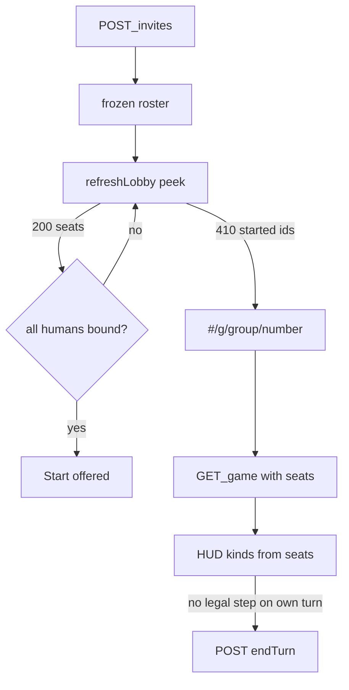

# online-playtest-ux — first-two-minutes lobby and HUD

**Packet:** [P26 — Playtest online UX](../../design/packets/P26-playtest-online-ux.md)
**ADR:** [0002](../../adr/0002-cheap-async-online.md) (amended 2026-08-14, P26)
**Amends:** [online-auth-invites](../online-auth-invites/online-auth-invites.md) · [online-moves-ws](../online-moves-ws/online-moves-ws.md) · [online-web](../online-web/online-web.md) · [online-shell](../online-shell/online-shell.md)
**Features:** [core](./online-playtest-ux.core.feature) · [edge cases](./online-playtest-ux.edge-cases.feature)

## Purpose

Family playtest showed the engine works and the lobby does not. This packet
makes the host see who joined, stops guests rewriting chairs, shows the same
seat kinds on every device, and makes "passing…" actually POST `endTurn`.

Tests stay on ports and fakes. No live Google or AWS. `rules-core` stays pure.

## Terms

| Term | Means |
|---|---|
| **roster** | Invite `seats` shown read-only once a token is live |
| **you** | The signed-in `userHash` occupies that human chair |
| **waiting** | Human chair with no `userHash` yet |
| **Player / AI** | Display labels for `human` / `heuristic` — API JSON unchanged |
| **refreshLobby** | Peek the held invite token (unauth GET) and GET `/my-games` when signed in |
| **started ids** | `groupHash` + `gameNumber` on HTTP 410 `{ reason: "started", … }` |

## HTTP deltas

GET `/games/{groupHash}/{gameNumber}` 200:

```text
{ "version": <n>, "state": <GameState JSON>, "seats": <InviteSeat[]> }
```

`seats` is game meta. Missing meta still 404. Google `sub` never appears.

HTTP 410 on a **started** invite (GET/accept/start of that token):

```text
{ "reason": "started", "groupHash": "<32 hex>", "gameNumber": "<6 digits>" }
```

when the invite record can supply them. `revoked` stays `{ "reason": "revoked" }`.
Clients that only read `reason` keep working.

## Flow



## Invariants

- When GET game succeeds, the system shall include that game's meta `seats` in the 200 body and shall not include Google `sub`.
- When an invite's status is `started` and GET/accept/start of that token is 410, the system shall include `reason` `started` and, when known, `groupHash` and `gameNumber`.
- When the signed-in `userHash` already occupies a human chair on the held invite, the host shall not offer Accept.
- When the held invite has a token and is not gone, the host shall not offer seat-kind edits.
- When `refreshLobby` runs with a held invite token and no open board, the adapter shall GET that invite (no bearer).
- When that peek is 410 `started` with `groupHash` and `gameNumber`, the adapter shall open that game hash and GET the game.
- When `visibilitychange` becomes visible, the adapter shall peek a held invite token as well as GET an open game.
- When the online GET board is the caller's turn and `legalMoves` has no `step`, the shell shall POST `endTurn` via `submitMove` and shall not local-`apply`.
- When Local mode auto-passes, the system shall still apply `endTurn` in-process and shall not fetch `VITE_API_BASE`.
- When two clients GET the same game, the system shall return the same seat kinds for each chair.
