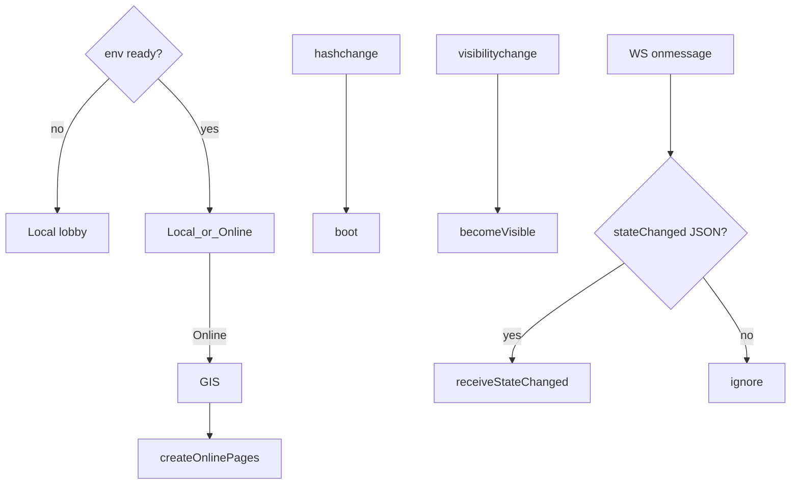

# online-shell — Pages host for the P19 adapter

**Packet:** [P25 — Pages online shell](../../design/packets/P25-pages-online-shell.md)
**ADR:** [0002](../../adr/0002-cheap-async-online.md) (amended 2026-08-14, P25)
**Adapter:** [online-web](../online-web/online-web.md) (P19)
**Features:** [core](./online-shell.core.feature) · [edge cases](./online-shell.edge-cases.feature)

## Purpose

P19 shipped `createOnlinePages`. This packet is the **host** that Pages actually
runs: GIS script, `window` `hashchange` / `visibilitychange`, a real
`WebSocket` `onmessage`, Vite env on the Pages workflow, and the Local | Online
lobby chrome.

Tests drive `createOnlineHost` with fake window/GIS/`fetch`/WebSocket — **no
React Testing Library**, no live Google/AWS. `App.tsx` / `Lobby.tsx` call the
host; they are not the test surface.

No new AWS. GIS ID-token Sign-In is the existing public client.

## Terms

| Term | Means |
|---|---|
| **host** | `createOnlineHost` — binds DOM-ish facades to `OnlinePagesPort` |
| **shell** | React (`App` / `Lobby`) reading the host snapshot |
| **Start offered** | Online: every human on `inviteSeats()` is bound. Local: today's seat-plan ready |

## Host bindings

| Event | Host |
|---|---|
| GIS credential | `deliverGoogleCredential` |
| WS text JSON `stateChanged` | `receiveStateChanged` (ignore invalid JSON) |
| `hashchange` | `boot` |
| `visibilitychange` → visible | `becomeVisible` |
| Sign-In click | `gis.offerChooser()` (P27; One Tap `prompt()` stays auto unsigned-invite / 401) |

HTTP **410** on invite is gone even when `reason` is missing (P19 boy-scout).

422: host remembers `illegal` for the shell; adapter still keeps last GET.

Pages workflow sets `VITE_API_BASE`, `VITE_WS_URL`, `VITE_GOOGLE_CLIENT_ID`
(`vars.VITE_GOOGLE_CLIENT_ID`). Empty client id → Online hidden.

## Flow

## Invariants

- When any of `VITE_API_BASE`, `VITE_WS_URL`, or `VITE_GOOGLE_CLIENT_ID` is empty, the host shall not offer Online mode.
- When Local mode Starts, the host shall not `fetch` `VITE_API_BASE` and shall not open a WebSocket.
- When GIS yields an ID token, the host shall call `deliverGoogleCredential` with that token.
- When the unsigned player clicks Sign-In, the host shall call GIS `offerChooser` (P27). Auto unsigned-invite / 401 still One Tap `prompt`.
- When a WebSocket message is valid `stateChanged` JSON, the host shall call `receiveStateChanged`. When it is not valid JSON or not that type, the host shall not replace the open board.
- When `hashchange` fires, the host shall `boot`.
- When the hash is `#/invite/<token>` or `#/g/…` and Online env is ready, the host shall select Online mode.
- When signed in on an open invite that is not gone and not full, the host shall offer Accept and shall not auto-accept.
- When `visibilitychange` becomes visible, the host shall `becomeVisible`.
- When Online mode has an invite whose human seats are not all bound, the host shall not offer Start.
- When Online mode has an invite whose human seats are all bound, the host shall offer Start.
- When the signed-in user already occupies a human chair on the held invite, the host shall not offer Accept (P26).
- When the held invite has a token and is not gone, the host shall not offer seat-kind edits (P26).
- When `refreshLobby` runs with a held invite token and no open board, the adapter shall GET that invite (P26).
- When the host submits an online move, the board shall be the adapter GET board — not a local `apply`.
- When invite GET or accept returns HTTP 410, the host shall not POST accept, even if `reason` is missing.
- When POST moves returns 422, the host shall surface `illegal` and shall keep the last GET board.
- When the player signs out via the host, the session key shall be gone and the WebSocket closed.
