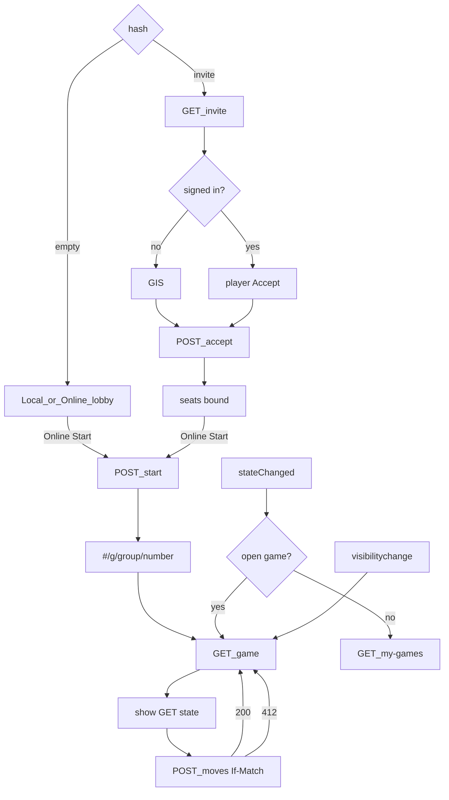

# online-web — Pages Sign-In, lobby, play, library

**Packet:** [P19 — Online web adapter](../../design/packets/P19-online-web-adapter.md)
**ADR:** [0002](../../adr/0002-cheap-async-online.md) (amended 2026-08-14, P19)
**API:** [P17 invites](../online-auth-invites/online-auth-invites.md) · [P18 moves/WS](../online-moves-ws/online-moves-ws.md)
**Features:** [core](./online-web.core.feature) · [edge cases](./online-web.edge-cases.feature)

## Purpose

Wire the GitHub Pages playtest client (`games.hochgi.com/conquarrow/`) to the
cheap online API. Local hot-seat, heuristic, and BYOK stay in the browser and
**must not** call the API. Online play uses Google Identity Services, REST, and
a WebSocket wake-up. The board is the last **GET** state — never an optimistic
local `apply` of an online move.

Tests drive a Pages online **adapter** (hash router, session, HTTP/WS facades)
with a **fake GIS callback**, **fake `fetch`**, **fake WebSocket**, and
**fake `sessionStorage`**. They never call live Google, AWS, or API Gateway.

`rules-core` stays pure. Game rules are unchanged.

## Env (Vite, not in git)

| Variable | Production |
|---|---|
| `VITE_API_BASE` | `https://api.games.hochgi.com/conquarrow` |
| `VITE_WS_URL` | `wss://ws.games.hochgi.com/conquarrow` |
| `VITE_GOOGLE_CLIENT_ID` | Pages OAuth client id (`aud`) |

Online mode is **off** unless all three are non-empty. CORS already allows
`https://games.hochgi.com` and `http://localhost:5173`.

## Terms

| Term | Means |
|---|---|
| **GIS** | Google Identity Services in the page; yields an ID token |
| **session token** | That ID token in `sessionStorage` under `conquarrow:google-id-token` |
| **hash route** | `location.hash` path. Invite: `#/invite/<token>`. Game: `#/g/<groupHash>/<gameNumber>` |
| **Local mode** | Today's lobby and match. No `fetch` to `VITE_API_BASE`, no WS |
| **Online mode** | Sign-In required. Seat kinds are `human` or `heuristic` only (no BYOK). Create/accept/start/play hit the API |
| **open game** | The hash route is `#/g/…` and the adapter holds that GET body |
| **in-flight move** | A `Move` the player just submitted; discarded on 412 |

## Hash routes

| Hash | Screen |
|---|---|
| (empty or unknown) | Lobby (Local \| Online) |
| `#/invite/<token>` | Invite: peek, Sign-In if needed, accept |
| `#/g/<groupHash>/<gameNumber>` | Game board (GET). Finished = view-only |

Copy-invite URL: `{origin}{pathname}#/invite/<token>` (Pages pathname is
`/conquarrow/`).

## Lobby

One lobby with **Local | Online**.

- **Local:** unchanged playtest (3/6, human / heuristic / BYOK). Start never
  calls the API, including 1-human+AI and all-AI.
- **Online:** Sign-In first. BYOK is not offered. Plan must have ≥2 `human`
  seats before Create. Copy-invite after create. Start enabled when every
  **human** seat is bound (heuristic may remain). Start → `#/g/<groupHash>/<gameNumber>`.
  Any bound human may Start (P17).

## Play

Online input uses the same move UI. The adapter POSTs `{ "move" }` with
`If-Match: "<version>"` from the last GET, then **GETs** (the mover is not
notified on WS). The board becomes that GET. Heuristic seats run on the
server; the client does not `playBotTurn` in Online mode.

Whose turn (client, BSSN): Sign-In GETs `/me` for `userHash`. Combined with
invite `seats` still in this adapter instance and P18 `players[i]` = seat *i*,
the adapter skips POST when it can tell the caller is not the active seat.
`GET /games/...` is `{ version, state }` only — no seats — so a hash-boot with
no seats in memory does **not** invent a client-side block. The server still
answers 403 when the bearer is not the active human seat (P18).

Finished: members may open the URL; the board is the terminal GET; no POST.

Auto-replay is P20+. Rematch is a new invite from the lobby, not a button on
the finished board.

## Session and WS

Sign-In stores the ID token in `sessionStorage` and opens
`VITE_WS_URL?access_token=<token>` **while signed in** (any screen). Sign-out
clears the key, closes the socket, and returns to the lobby hash.

Refresh in the same tab restores the token, reconnects WS, and re-GETs if the
hash is a game.

`visibilitychange` to visible: GET the open game (no poll loop).

`stateChanged` for the **open** game → GET that game. For any other
`groupHash`/`gameNumber` → refresh `/my-games` only; do not replace the open
board.

## Errors

| API | Adapter |
|---|---|
| 412 on POST moves | GET the game, **drop** the in-flight move, show the new board |
| 422 | keep last GET board, do not local-apply. A visible "illegal" string is the React shell (this packet's port has no error channel) |
| 409 `finished` | GET terminal, stop POSTing |
| 401 | prompt GIS again; keep the current hash |
| 409 on accept | "game full"; do not enter as viewer |
| 410 on invite | show `revoked` or `started`; do not accept |

Google `sub` never appears in UI copy that echoes API bodies (API already omits
it). The session key holds the JWT, not `sub`.

## Flow

Peek is unauthenticated. An unsigned peek prompts GIS; GIS then POSTs accept.
A signed-in boot peeks only — it does not auto-accept. After accept, invite
state stays in the adapter (hash may remain `#/invite/<token>`) until Start.

## Invariants

- When Local mode Starts, the adapter shall not `fetch` `VITE_API_BASE` and shall not open a WebSocket.
- When any of `VITE_API_BASE`, `VITE_WS_URL`, or `VITE_GOOGLE_CLIENT_ID` is empty, the adapter shall not offer Online mode.
- When Online mode is selected, the adapter shall not offer a BYOK seat.
- When Online create is offered, the seat plan shall contain at least two `human` seats.
- When the player is signed in, the adapter shall keep the ID token only in `sessionStorage` under `conquarrow:google-id-token` and shall open one WebSocket with that token as `access_token`.
- When the player signs out, the adapter shall remove that session key and close the WebSocket.
- When the hash is `#/invite/<token>` and the player has no session token, the adapter shall peek the invite and prompt GIS before accept.
- When accept returns 409, the adapter shall show the lobby as full and shall not open a game board.
- When Start succeeds, the adapter shall set the hash to `#/g/<groupHash>/<gameNumber>` and GET that game.
- When an online move is submitted, the adapter shall POST with `If-Match` equal to the last GET version, then GET, and shall set the board from that GET — not from a local `apply`.
- When POST moves returns 412, the adapter shall GET, drop the in-flight move, and shall not POST that move again.
- When POST moves returns 422, the adapter shall keep the last GET board and shall not persist a local apply.
- When the open game's `state.winner` is set, the adapter shall not POST moves.
- When `stateChanged` names the open game, the adapter shall GET that game. When it names another game, the adapter shall not replace the open board.
- When `visibilitychange` becomes visible and a game is open, the adapter shall GET that game.
- The adapter shall not include Google `sub` in copied invite URLs (token only).
- Library resume shall open `#/g/<groupHash>/<gameNumber>` and GET; the listed rows are that user's `/my-games` only.
