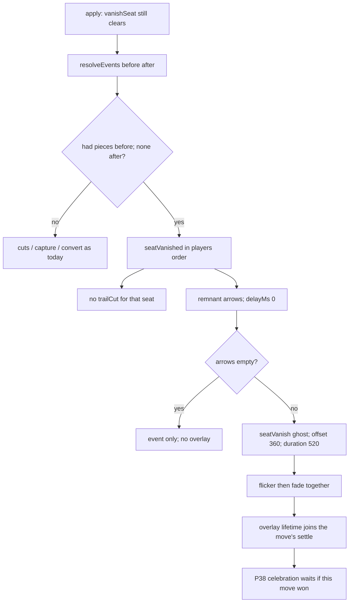

# seat-vanish-fx — flicker-then-fade when a seat vanishes

**Packet:** [P39 — Flicker-then-fade when a seat vanishes](../../design/packets/P39-seat-vanish-fx.md)
**SPEC:** §9 (vanish still *clears*), §6.1 (evaporation stays cut-only), §11 item 45 (**resolved: presentation, not a new trigger**).
**Layer:** `packages/web` event / present / BoardFx / sound, and the P32 cut proxy.
**Features:** [core](./seat-vanish-fx.core.feature) · [edge cases](./seat-vanish-fx.edge-cases.feature)

## Purpose

P36 made a lost seat vanish by clearing its heads, trail marks and leftover
territory. That clearance is silent in the engine on purpose: evaporating a
whole trail from a non-cut event would be a new §6.1 trigger, and inventing one
is out of bounds.

The adapter currently *does* invent a reading, and it is the wrong one. Every
trail drop that is not a self-claim is named `trailCut` and presented as
`cutSnap` + `evaporate` — so a seat leaving the match looks like someone crossed
its trail. Leftover land that reverts to unowned plays `lossRetract`. Heads that
simply disappear name nothing. The human asked for **flicker-then-fade**.

This feature names the vanishing and presents it as one metaphor that is neither
a cut nor a pop.

## The rule (decided; do not re-litigate)

**The engine still clears.** `vanishSeat` is unchanged. Fronts, firebreaks and
per-arrow halt stay cut-only (§6.1). Item 45 is resolved *against* a new
evaporation trigger.

**The adapter names a vanish from the diff**, then paints a ghost of the remnants
that flickers and fades.

## Terms

| Term | Means |
|---|---|
| **vanish** | P36: the lost seat's heads, trail marks and leftover territory are gone from `after` |
| **piece** | a group this player owns, a trail arrow in their set, or a territory arrow they own |
| **remnant** | arrows that player is leaving that nobody holds afterwards — dropped trail, vacated (unowned) territory, disappeared groups |
| **flicker-then-fade** | two brief opacity dips in the vanished seat's colour, then fade to 0, every remnant cell together |
| **cut** | §6.1 evaporation, presented as `cutSnap` + `evaporate`, staggered from the cut arrow |

Do not say *evaporate* for a vanish. Do not say *cut* for a trail that left with
its owner.

## Detection (normative)

The event layer does not call `isLost` and does not re-run the §9 table. It
reads the step.

```
hadPieces(state, p) =
  some group in state.groups has owner p
  or (state.trails.get(p)?.size ?? 0) > 0
  or some arrow in state.territory is owned by p

vanishedPlayers(before, after) =
  [p in before.players | hadPieces(before, p) and not hadPieces(after, p)]
  in before.players order
```

A seat with no pieces in `before` is not named again.

## Remnant set (normative)

```
droppedTrail(p)     = arrows in before.trails.get(p) that are not in after.trails.get(p)
vacatedTerritory(p) = arrows where before.territory.get(arrow) = p
                      and after.territory.get(arrow) is unset
disappearedGroups(p)= arrows where before.groups.get(arrow).owner = p
                      and after.groups.get(arrow) is unset

remnant(p) = (droppedTrail(p) ∪ vacatedTerritory(p) ∪ disappearedGroups(p))
             minus any arrow after still holds as territory or as a group
             sorted by arrow id
             capped at MAX_FX_CELLS (120)
```

Captured land (`after.territory` is someone else) and converted stacks
(`after.groups.owner` changed) stay on their own events. They are not remnants.

## Events (normative)

For each vanished player, in `before.players` order, emit:

```
seatVanished { player, arrows: remnant(p) }
```

`arrows` may be empty: the last land was captured and nothing else remained.
The event still names the seat.

On that same step, for each vanished player:

- do **not** emit `trailCut` for them
- do **not** emit `territoryLost` for arrows that became unowned
- **do** still emit `territoryLost` (and the mover's `territoryCaptured`) for
  arrows another player now holds
- **do** still emit `unitsConverted` where a group changed owner in place
- **do** still emit `trailCut` / `evaporate` for a *living* bystander whose
  trail actually burned

Causal order in `resolveEvents` is unchanged except that `seatVanished` sits
after conversions and births, before `turnPassed` / `matchWon`.

`matchWon` still has no overlay. P29 / P38 own the celebration.

## Overlay (normative)

```
present(seatVanished):
  if arrows is empty: no overlay
  else one overlay {
    kind: seatVanish
    player
    cells: each remnant arrow with delayMs 0
    offsetMs: 360
    durationMs: 520
    tier: 1
  }
```

No spatial stagger. That is how a player tells vanish from evaporate.

The board already renders `after`, so the remnants are gone from state. The
overlay paints them as a ghost (fill + chord in `styleFor(player)`), held
visible at the 0 % keyframe during the 360 ms delay, then flicker-then-fade.

Flicker is two opacity dips (visible → dim → visible → dim) in the first ~48 %
of the 520 ms, then fade to 0. Base state is visible — none of these start at
`opacity: 0` (`styles.css` effect-layer rule, `prefers-reduced-motion` holds
the ghost for the overlay's lifetime).

Paint order: `seatVanish` sits above `conversion` and below `emergence` — the
consequence of the move, on top of the capture / convert that caused it, under
the local impact marks.

Do not retune any other `FX_MS` / `FX_OFFSET_MS` value.

## Sound (normative)

`seatVanish` is audible. Locked cue:

- fromHz 392, toHz 147, ms 260, gain 0.05, wave `sine`

Falling, longer than `cutSnap` (sawtooth 740 → 180 over 130 ms). Ordinary
movement stays silent. `AUDIBLE_KINDS` gains this one kind.

## P32 cut proxy (normative)

Supersedes `docs/spec/match-summary-telemetry/match-summary-telemetry.md`
invariant *"When a player's trail shrinks and that player's territory count did
not increase, the system shall increment `cuts`"*:

```
vanished(before, after, p) = hadPieces(before, p) and not hadPieces(after, p)

cutVictims(before, after) =
  { p | trailSize(after, p) < trailSize(before, p)
        and p not in gainers
        and not vanished(before, after, p) }
```

A living player's trail shrink is still a cut. A vanished player's is not.

## Flow



## Invariants (EARS)

1. When a player had at least one piece before a step and has none after, the
   system shall emit `seatVanished` for that player.
2. When the system emits `seatVanished` for a player, it shall not emit
   `trailCut` for that player on that step.
3. When the system emits `seatVanished` for a player, it shall not emit
   `territoryLost` for arrows that became unowned.
4. The system shall still emit `territoryLost` for a vanished player's arrows
   that another player holds after the step.
5. The system shall still emit `unitsConverted` where a vanished player's group
   changed owner in place.
6. The system shall present a non-empty `seatVanished` as one `seatVanish`
   overlay whose every cell has `delayMs` 0.
7. The system shall not present a vanished player's remnant trail as `evaporate`
   or `cutSnap`.
8. While a player still holds a piece after the step, the system shall not emit
   `seatVanished` for them.
9. The system shall emit `seatVanished` events in `before.players` order.
10. Equal steps shall yield equal `seatVanished` events and equal overlay cell
    order.
11. `vanishSeat` shall still clear heads, trail marks and leftover territory,
    and shall not run §6.1 evaporation for the loss. *(This packet does not
    edit `rules-core`; the invariant is that the engine behaviour is unchanged.)*
12. When a vanished player's trail shrinks, `foldMatchSummary` shall not
    increment `cuts` for that shrink.
13. The system shall include a `seatVanish` overlay's lifetime in the settle
    time of the move that queued it.
14. `resolveEvents` and `presentEvents` shall reference neither a clock nor a
    random source.
15. When `seatVanished.arrows` is empty, the system shall emit the event and
    shall present no overlay.
16. Every `seatVanish` cell shall be an arrow the vanished player held as trail,
    as vacated territory, or as a disappeared group, and shall not be an arrow
    another player holds after the step.

## What this file deliberately does not decide

- Who is lost, when, or what leftover land becomes — P36 / P37 / §9.
- When the celebration begins — P38. This packet only adds an overlay that
  queue already waits on.
- Retuning *N*, band radii, `MAJOR_SEQUENCE_MS`, or any existing `FX_MS`.

## Scenario count

12 core + 16 edge = **28** scenarios. **16** EARS invariants.
§11 item 45 resolved: no new evaporation trigger; flicker-then-fade in the adapter.
