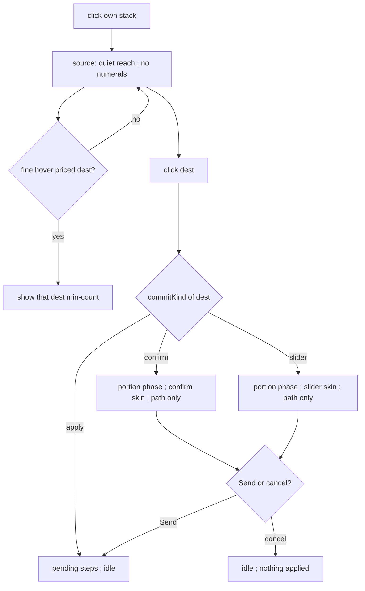

# selection-chrome — quieter reach, deferred cost, path-only commit, selected halo

**Packet:** [P31 — Quieter selection chrome](../../design/packets/P31-selection-chrome.md)
**SPEC:** §4 Galcon interaction (read, do not change), §3 allowance (read)
**Layer:** `packages/web` only. Does not touch `rules-core`, contracts DTOs, ADR 0002.
**Features:** [core](./selection-chrome.core.feature) ·
[edge cases](./selection-chrome.edge-cases.feature)

## Purpose

Playtest: after selecting a stack, every reachable destination is a bright
cyan tile with a min-count numeral, all at once, and the selected stack is
easy to lose among gold-outlined movables. Quiet the dest marks, show the
travel cost only on hover (mouse) or the dest tap that opens a send dialog
(touch), light only the path while that dialog is open, and mark the selected
stack with a static cream halo. Unique-portion trips that cost more than one
head get a confirm (no slider) instead of auto-applying.

## Scope

In: a pure helper `packages/web/src/selectionChrome.ts`; Galcon `openPortion`
commit kind; `PortionSlider` confirm skin; Board paint of quiet wash / numeral
/ path-only / selected halo; Hud hint copy. Tests against the helper +
`GalconInput` (same posture as `fx/victory.ts` / `input.test.ts`). No RTL.

Out: `speed(N)` / reach simulation, HoMM mode, auto-apply of 1-head trips,
SPEC.md, `rules-core`, restoring selection on cancel.

## Terms

| Term | Means |
|---|---|
| **reach wash** | quiet cyan mark on a reachable destination in source phase |
| **min-count numeral** | fewest heads that arrive at that dest (`ReachEntry.minCount`) |
| **priced dest** | a reach dest whose `minCount > 1` |
| **commit dialog** | the send popup — slider or confirm |
| **confirm** | unique allowed portion `> 1`; Cancel / Send N; no range |
| **slider** | two or more allowed portions; existing range UI |
| **path wash** | the route that will be applied for the current preview / portion |
| **selected halo** | cream outer stroke + warm wash on the source stack |
| **fine pointer** | mouse (`pointerType` other than `touch` / `pen`) |
| **coarse pointer** | `touch` or `pen` |
| **allowed set** | `ReachEntry.plans` keys — portions that actually arrive |

Do not say *splash*. The commit dialog is the existing portion backdrop.

## Commit kind (normative)

```
allowed = sorted keys of entry.plans

if |allowed| = 1 and allowed[0] = 1:
  kind = apply          # auto-commit, no dialog
else if |allowed| = 1:
  kind = confirm        # dialog, no range
else:
  kind = slider         # dialog, range over allowed
```

`2^k` heads to distance `k+1` is confirm: `speed(2^k) = k+1`, so the only
portion that arrives is the whole stack.

## Paint (normative)

```
selectionPaint({ phase, highlights, hoverArrow, pointer }):
  selected = highlights.selected
  path = highlights.path ?? empty
  reachKeys = keys of highlights.reach except selected

  if phase.kind is portion:
    reachWash = empty
    minCountArrows =
      dest = phase.exit
      if dest's minCount > 1: { dest } else empty
    selectedEmphasis = selected is set
    return { selected, reachWash, path, minCountArrows, selectedEmphasis }

  if phase.kind is source:
    reachWash = reachKeys
    minCountArrows = empty
    if pointer is fine
       and hoverArrow is in reachKeys
       and that entry.minCount > 1:
      minCountArrows = { hoverArrow }
    selectedEmphasis = selected is set
    return { selected, reachWash, path, minCountArrows, selectedEmphasis }

  reachWash = empty
  minCountArrows = empty
  selectedEmphasis = selected is set
  return { selected, reachWash, path, minCountArrows, selectedEmphasis }
```

Locked constants:

- `REACH_WASH_PEAK = 0.22` — `reachOpacity(1)`
- `REACH_WASH_FLOOR = 0.08`
- `SELECTED_HALO_STROKE = '#f4efe4'`
- `SELECTED_WASH = 'rgba(255, 236, 180, 0.30)'`
- `SELECTED_STROKE_WIDTH = 4.8`

Locked HUD strings (source / portion):

- source: `Quiet cyan = reachable · hover or tap a dest for the cost · click to send`
- portion (slider or confirm): `Only the path is lit · Send or cancel`

## Helper shape

```
PointerKind = fine | coarse
CommitKind = apply | confirm | slider

SelectionPaint = {
  selected?: ArrowId
  reachWash: ReadonlySet<ArrowId>
  path: ReadonlySet<ArrowId>
  minCountArrows: ReadonlySet<ArrowId>
  selectedEmphasis: boolean
}

commitKind(entry: ReachEntry): CommitKind
portionDialogKind(allowed: readonly number[]): 'slider' | 'confirm' | 'none'
selectionPaint(opts): SelectionPaint
```

`portionDialogKind`: length 0 → `none`; length 1 → `confirm`; else `slider`.

**Dest map:** `select()` strips the source arrow from `highlights.reach`
(`withoutSource` in `input/modes.ts`). A stack can simulate a hop that lands
back on its own tile; Galcon treats a click on the source as deselect, so
that hop is not a send dest. `selectionPaint` also omits `selected` from
`reachWash`. The filter is load-bearing for `targets` / `reach`, not only paint.

## Flow



## Invariants

- When the input is in source phase, the system shall paint a reach wash on
  every reachable dest and shall not paint a min-count numeral on any dest
  that is not the fine-pointer hover.
- When the fine pointer hovers a reach dest whose `minCount` is 1, the
  system shall not paint a min-count numeral.
- When the pointer is coarse and the phase is source, the system shall not
  paint a min-count numeral.
- When a commit dialog is open, the system shall paint path wash on the
  committed route and shall not paint reach wash on any other dest.
- When the allowed set has exactly one portion equal to 1, the system shall
  apply that trip without opening a dialog.
- When the allowed set has exactly one portion greater than 1, the system
  shall open a confirm dialog and shall not apply until Send.
- When the allowed set has two or more portions, the system shall open a
  slider dialog.
- When the selected stack is set and play highlights are allowed, the
  system shall mark it with selected emphasis (halo + wash), not merely the
  movable gold outline.
- `reachOpacity(1)` shall equal `REACH_WASH_PEAK` (0.22) and
  `reachOpacity` shall be monotone non-increasing and never below
  `REACH_WASH_FLOOR` (0.08).
- Equal `selectionPaint` inputs shall yield equal `reachWash` and
  `minCountArrows` sets.
- The helper shall not call `Date.now` or `Math.random`.
- The rules engine shall be unchanged: no edit to `packages/rules-core`.

## What this file deliberately does not decide

- Allowance and which dests are legal — P04 / `reach.ts`, already shipped.
- Self-convert refusal wash — P28.
- Match-over dropping play highlights — P29.
- Cancel restoring the previous source selection — still idle.
