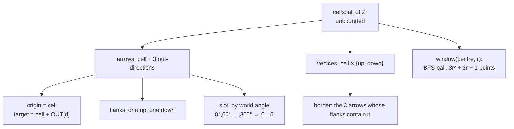

# tiling — generating the board

**Packet:** [P03 — Tiling generator](../../design/packets/P03-tiling.md)
**SPEC:** §2 (the board, formal definition, orientation pattern, *the board is unbounded*), §7 (specials on vertices), §11 items 1, 4, 5, 16, 29
**Features:** [core](./tiling.core.feature) · [edge cases](./tiling.edge-cases.feature)

## Purpose

> **The board is a constant, not a construction.** `makeTiling()` takes no
> arguments and returns a `GeometryPort` over the oriented triangular lattice,
> unbounded.

There is nothing to measure, nothing to trace, and — since SPEC §11 item 4 — no
size to choose. §11 item 1 resolved to alternating, so the lattice is fully
determined by two basis vectors and three out-directions, all of them constants.

**The generator is therefore stateless.** It precomputes nothing and stores
nothing: every answer is arithmetic on the identifier it was handed. That is not
an optimisation, it is what an unbounded board forces, and it makes a whole class
of determinism bug unreachable — there are no arrays to build in the wrong order
and no caches to iterate.

## Scope

This is the first real `GeometryPort` implementation, so it inherits the whole
conformance suite — **37 assertions, which must pass unedited.** Editing one is
not a fix; it is evidence the port leaked something concrete, and that is the
finding to report.

What is **not** here: any rule. This packet answers *what is adjacent to what*,
never *what may move*. The tile's drawn outline is [layout](../layout/layout.md).
Where spawners sit and how strong they are is setup (§7, §8) and belongs to P09 —
the generator has no opinion about the cutoff radius and never reads one.

## Terms

| Term | Means |
|---|---|
| **cell** | a lattice coordinate `(i, j)` ∈ ℤ², one per point; the generator's internal name for a point |
| **out-direction** | one of the three lattice vectors an arrow may follow |
| **up / down triangle** | the two triangles a cell owns, at `+(⅓,⅓)` and `+(⅔,⅔)`; these are its two spawner vertices |
| **parity** | whether a triangle is up or down — load-bearing for [layout](../layout/layout.md), invisible to the port |
| **window** | a graph-distance ball; the only way to enumerate anything (§11 item 4) |

## The construction

The three out-directions are `{(1,0), (-1,1), (0,-1)}` over basis
`u = (1,0)`, `v = (½, √3⁄2)`. They **sum to zero** *and* sit **120° apart**, and
both matter — see the edge cases, where a set satisfying only the first is
specified as a rejected alternative rather than left as a comment.

## Invariants

- The system shall satisfy every assertion in the `GeometryPort` conformance
  suite, unedited.
- The system shall answer every adjacency query for every cell in ℤ², with no
  cell rejected for being far from the origin.
- When given a window of radius `r`, the system shall report exactly
  `3r² + 3r + 1` points.
- The system shall report exactly `3` arrows originating at each of a window's
  points.
- The system shall report exactly one up-triangle and one down-triangle as an
  arrow's two flank vertices.
- The system shall place every point on exactly 6 minimal directed cycles.
- The system shall assign a point's in-arrows and out-arrows to alternating slots.
- The system shall assign the same slot to an arrow on every query.
- The system shall reject `slotOf` for an arrow that is not incident to the given
  point.
- The system shall reject any identifier minted against another board.
- The system shall return identical windows from two independently constructed
  generators.
- The system shall hold no mutable state and precompute nothing.

## What replaced the board size

`makeTiling(n, m)` and the **4×4 floor** are both gone, and they went together.
The floor existed only because wrap collapsed *girth-3 encloses exactly one
vertex* on small tori — at 2×2 the triangle count fell to 4 against 8 vertices,
and at any `n = 3` three steps of one out-direction wrapped to zero and
manufactured a straight-line "triangle" enclosing nothing. **SPEC §11 item 4
removed the wrap**, so both properties are now local and hold everywhere,
unconditionally, and there is no size to be below.

What used to be the board-size knob is now the spawner cutoff radius *R* (§7,
*the radial gradient*), which is **setup data and not the generator's business**.
The one degenerate input left is the window radius, and the edge cases pin it.

## The out-directions are the one constant a test cannot catch

`{(1,0), (0,1), (-1,-1)}` also sums to zero and passes **every assertion in the
suite** — it is the same graph under an `SL₂(ℤ)` change of basis. It sits at
0°/60°/210°, so a board built from it is skewed, and every rule behaves
identically on it.

So the conformance suite cannot distinguish the right constant from the wrong one,
and only [layout](../layout/layout.md) can. That is the argument for layout being
specified in this packet rather than deferred to the renderer: it is the only
executable check on a constant the rules cannot see.
