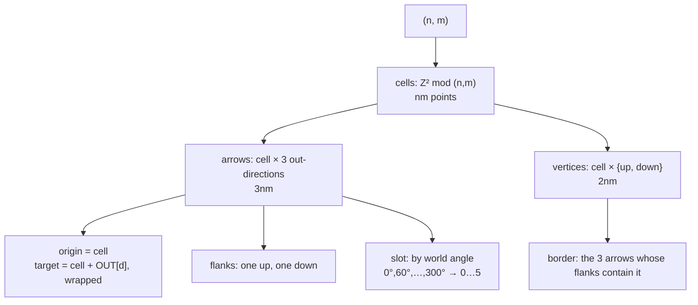

# tiling — generating the board

**Packet:** [P03 — Tiling generator & torus wrap](../../design/packets/P03-tiling.md)
**SPEC:** §2 (the board, formal definition, orientation pattern), §7 (specials on vertices), §11 items 1, 5, 16, 29
**Features:** [core](./tiling.core.feature) · [edge cases](./tiling.edge-cases.feature)

## Purpose

> **A board is a pure function of two integers.** `makeTiling(n, m)` returns a
> `GeometryPort` over the oriented triangular lattice mod `(n, m)`.

There is nothing to measure and nothing to trace. §11 item 1 resolved to
alternating, so the lattice is fully determined and this packet *generates*.

## Scope

This is the first real `GeometryPort` implementation, so it inherits the whole
conformance suite — **28 assertions, which must pass unedited.** Editing one is
not a fix; it is evidence the port leaked something concrete, and that is the
finding to report.

What is **not** here: any rule. This packet answers *what is adjacent to what*,
never *what may move*. The tile's drawn outline is [layout](../layout/layout.md).

## Terms

| Term | Means |
|---|---|
| **cell** | a lattice coordinate `(i, j)`, one per point; the generator's internal name for a point |
| **out-direction** | one of the three lattice vectors an arrow may follow |
| **up / down triangle** | the two triangles a cell owns, at `+(⅓,⅓)` and `+(⅔,⅔)`; these are its two spawner vertices |
| **parity** | whether a triangle is up or down — load-bearing for [layout](../layout/layout.md), invisible to the port |
| **seam** | where the torus wraps. Deliberately unobservable through the port |

## The construction

The three out-directions are `{(1,0), (-1,1), (0,-1)}` over basis
`u = (1,0)`, `v = (½, √3⁄2)`. They **sum to zero** *and* sit **120° apart**, and
both matter — see the edge cases, where a set satisfying only the first is
specified as a rejected alternative rather than left as a comment.

## Invariants

- When given `(n, m)`, the system shall report exactly `nm` points, `3nm` arrows
  and `2nm` vertices.
- The system shall satisfy every assertion in the `GeometryPort` conformance
  suite, unedited.
- The system shall reject a board smaller than 4×4 rather than return one that
  fails conformance.
- The system shall reject a board size that is zero, negative or fractional.
- The system shall resolve an adjacency query that crosses the seam without
  exposing where the seam is.
- The system shall return identical enumerations from two generators built from
  the same `(n, m)`.
- The system shall report exactly one up-triangle and one down-triangle as an
  arrow's two flank vertices.
- The system shall assign a point's in-arrows and out-arrows to alternating slots.
- The system shall assign the same slot to an arrow on every query.
- The system shall reject `slotOf` for an arrow that is not incident to the given
  point.
- The system shall reject any identifier minted against another board.

## Why 4×4 is the floor, and why rejecting is right

Measured, not estimated. Smaller tori fail *girth-3 encloses exactly one vertex*
because the wrap collapses or manufactures triangles:

| size | triangles vs vertices | what breaks |
|---|---|---|
| 1×m, m×1 | — | self-loops, and three arrows between one ordered pair |
| 2×2 | 4 vs 8 | wrap identifies triangles that should be distinct |
| 3×3 | 27 vs 18 | at `n = 3`, three steps of one out-direction wrap to zero and make a straight-line "triangle" enclosing nothing |
| 4×4 | 32 vs 32 | conformant |

A generator that quietly returned a 3×3 board would produce something that *looks*
like a board and fails an invariant the rules depend on — §7's "smallest territory
holds exactly one spawner" would simply be false on it. Rejecting matches every
other constructor in `contracts`, all of which refuse bad input rather than
returning a degenerate value.

This also bounds §11 item 11 from below: board-size tuning starts at 4×4.

## The out-directions are the one constant a test cannot catch

`{(1,0), (0,1), (-1,-1)}` also sums to zero and passes **every assertion in the
suite** — it is the same graph under an `SL₂(ℤ)` change of basis. It sits at
0°/60°/210°, so a board built from it is skewed, and every rule behaves
identically on it.

So the conformance suite cannot distinguish the right constant from the wrong one,
and only [layout](../layout/layout.md) can. That is the argument for layout being
specified in this packet rather than deferred to the renderer: it is the only
executable check on a constant the rules cannot see.
