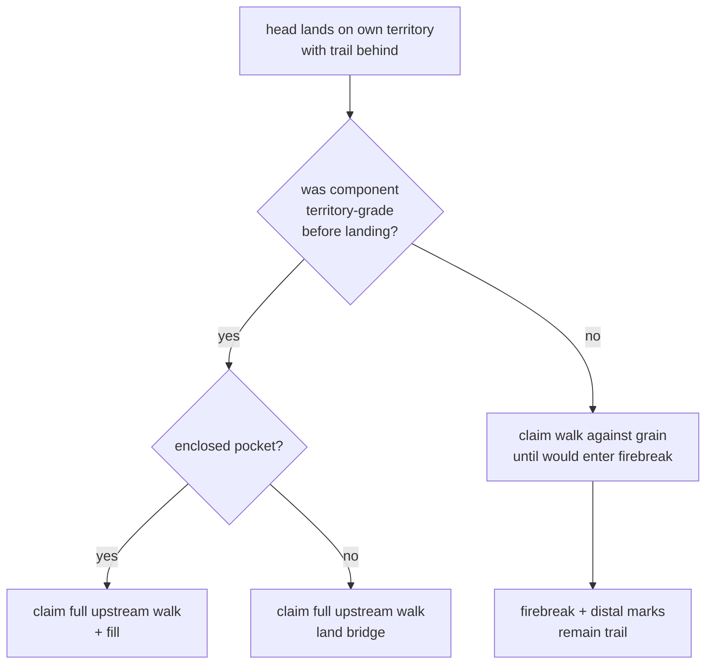

# trails-simple — P22 beta: free branching, legal dormant, capped reconnect paint

**Packet:** [P22 — Beta: simple trails](../../design/packets/P22-beta-simple-trails.md)
**SPEC:** §5 (branching free), §6.1 / §6.1a (dormant legal, no freeze), §6.3
(convert strip, no scrub), §7 (claim walk + firebreak cap), §11 items 8, 23, 27,
35, 40, 42
**Features:** [core](./trails-simple.core.feature) · [edge cases](./trails-simple.edge-cases.feature)
**Beta:** throwaway branch `feat/beta-simple-trails` — may revert after playtest

## Purpose

Reverse the stuckness tax of P13 D2–D4 while keeping cut/fill/paint triggers.
Branching costs nothing; cut tails and headless marks persist; reconnecting an
unanchored fragment paints only up to the last firebreak.

## Scope

In: branch legality (none), dormant persistence, size-1 tip mobility, convert
without scrub, firebreak-capped claim on unanchored reconnect, full claim when
territory-rooted.

Out: combat math, spawners, GeometryPort, trail decay, merging to `main`.

## Terms

| Term | Means |
|---|---|
| **trail** | set of arrows marked by a player; may be headless |
| **territory grade** | continuous own-trail path to own territory |
| **stack grade** | reaches an own stack but not territory |
| **dormant** | reaches neither — **legal standing state** under P22 |
| **firebreak** | owner-occupied trail arrow that halts evaporation (and caps unanchored paint) |
| **unanchored reconnect** | landing on own territory from a component that was not territory-grade before the step |

## Flow

## Invariants

- WHEN a move creates or vacates a join or split, the system SHALL NOT refuse the move for unpaid branch toll.
- WHILE a trail component is dormant, the system SHALL leave its marks standing until cut evaporation or friendly re-attach.
- WHEN a size-1 stack is the sole stack on a stack-grade component, the system SHALL still permit a legal grain step that vacates its arrow.
- WHEN conversion strips trail from converted arrows, the system SHALL NOT evaporate remaining dormant orphan marks solely because they are dormant.
- WHEN a landing claims from a component that was territory-grade before the step, the system SHALL claim the full upstream walk (and fill enclosed pockets).
- WHEN a landing claims from a component that was not territory-grade before the step, the system SHALL claim only arrows on the against-grain walk until it would enter a firebreak, and SHALL leave the firebreak and distal trail marked.
- WHILE a head has a continuous own-trail path to own territory, the system SHALL NOT convert that head by encirclement alone.
- IF a head has no continuous own-trail path to own territory and sits inside enemy territory, THEN the system SHALL convert it.
