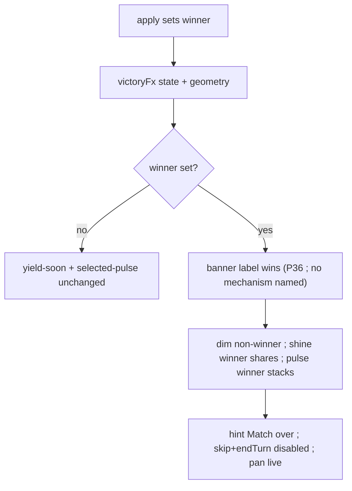

# win-board-celebration — match-over on the board, no splash

**Packet:** [P29 — Win board celebration](../../design/packets/P29-win-board-celebration.md)
**SPEC:** §9 (read, do not change), §7 (territory is infrastructure; shine shares)
**Layer:** `packages/web` only. Does not touch `rules-core`, contracts DTOs, ADR 0002.
**Features:** [core](./win-board-celebration.core.feature) ·
[edge cases](./win-board-celebration.edge-cases.feature)

## Purpose

Playtest asked: on win, shine all the winner's arrows with the same clip as
yield-soon. Celebrate on the board, reuse “life arriving” — and do **not**
spread yield-soon across an empire (that signal is taught) or shine land
(SPEC §7: territory has no intrinsic value). No splash: a modal would hide
the board the player just built.

Today a win is `{label} wins` in the HUD and a frozen SVG.

## Scope

In: a pure helper `packages/web/src/fx/victory.ts`; Board shine / pulse / dim;
suppress yield-soon and play highlights while over; Hud banner / hint / Skip
disabled; CSS reuse of `yield-shine-sweep` plus `.match-over-dim { opacity: 0.4 }`.

Out: new win conditions, SPEC.md §9, `packages/rules-core/src/victory.ts`,
splash/modal, auto-pan, audio, shining all winner territory.

Tests against the **pure helper** (same posture as `fx/evaporation.ts` /
`spawnerInfo.ts`). One Vitest per scenario. No `@vnatures/test-kit`, no React
Testing Library.

## Terms

| Term | Means |
|---|---|
| **over** | `state.winner` is set |
| **playing** | `state.winner` is unset |
| ~~**elimination**~~ | ~~over, and exactly one player has heads > 0~~ — **retired by P36** |
| ~~**starvation**~~ | ~~over, and two or more players have heads > 0~~ — **retired by P36.** A lost seat's heads are removed, so a winner always leaves exactly one seat with heads and this discriminant is constant. See `docs/spec/losing-conditions/losing-conditions.md`, *The victory banner must stop naming a mechanism* |
| **share arrow** | an arrow in `geometry.borderArrows(vertex)` for some `state.spawners` vertex |
| **victory shine** | winner-owned share arrows, full-strength winner-tinted yield clip |
| **victory pulse** | arrows holding a winner group |
| **match-over dim** | opacity 0.4 on arrows that are not winner territory, winner trail, or a winner group |

Field names `domination*` stay in state; the condition is starvation. Do not
say *splash* or *domination* in player-facing copy.

## Discriminant (normative)

```
heads(p) = sum of group.heads where group.owner = p

if state.winner is unset:
  playing
else if |{ p in state.players | heads(p) > 0 }| = 1:
  how = elimination
else:
  how = starvation
```

## Share set (normative)

```
shineArrows(state, geometry, winner):
  for each vertex in state.spawners.keys() (stable id order):
    for each arrow in geometry.borderArrows(vertex) (stable id order):
      if state.territory.get(arrow) == winner: include arrow
```

Include blockaded shares (enemy group on the arrow). Include shares that would
not yield this round. Exclude unclaimed and loser-owned borders.

## Dim predicate (normative)

```
isMatchOverDimmed(over, arrow, state):
  if not over: return false
  if state.territory.get(arrow) == winner: return false
  if winner trail has arrow: return false
  if state.groups.get(arrow).owner == winner: return false
  return true
```

## Helper shape

```
~~VictoryHow = elimination | starvation~~   # retired by P36

VictoryFx =
  | { kind: playing }
  | { kind: over, winner, how, banner, hint, shineArrows, pulseArrows }

victoryFx(state, geometry): VictoryFx
isMatchOverDimmed(fx, arrow, state): boolean
```

Locked strings:

- ~~banner elimination: `{label} wins — last head`~~ — **retired by P36**
- ~~banner starvation: `{label} wins — starvation`~~ — **retired by P36**
- banner (P36): `{label} wins`
- hint: `Match over — pan to look around`

`label` is `styleFor(winner).label` (`Player A` / `Player B`).

## Flow



## Invariants

- When `state.winner` is unset, the system shall not apply victory shine,
  victory pulse, match-over dim, or the match-over banner.
- When `state.winner` is set, the system shall not paint yield-soon shine.
- When `state.winner` is set, the system shall shine exactly the winner's
  share arrows and shall not shine a winner territory arrow that is not a share.
- ~~When `state.winner` is set and exactly one player has heads remaining, the
  banner shall be `{label} wins — last head`.~~
- ~~When `state.winner` is set and two or more players have heads remaining, the
  banner shall be `{label} wins — starvation`.~~ — **both superseded by P36:**
  when `state.winner` is set the banner shall be `{label} wins`, and shall not
  assert a losing mechanism. The head count no longer distinguishes the causes,
  and the cause is not derivable once the losing seat and its clock are gone.
- When `state.winner` is set, the system shall pulse every arrow that holds a
  winner group and shall not pulse a loser group.
- When `state.winner` is set, the system shall dim every arrow that is not
  winner territory, winner trail, or a winner group, at opacity 0.4.
- When `state.winner` is set, the system shall not offer Skip group or End turn.
- When `state.winner` is set, the system shall not render selected, reach, path,
  movable, or preview washes.
- The system shall not mutate `GameState` to produce the celebration; equal
  inputs shall yield equal shine and pulse sets.
- The system shall not cover the board with a splash, modal, or portion-backdrop.
- The rules engine shall be unchanged: no new win condition, no new field, no
  edit to `packages/rules-core/src/victory.ts`.

## What this file deliberately does not decide

- Elimination / starvation / *N* — P09 / SPEC §9, already decided.
- First-person “You win” copy — hot-seat and online use player labels.
- A viewport-wide second wash — rejected for v1.
