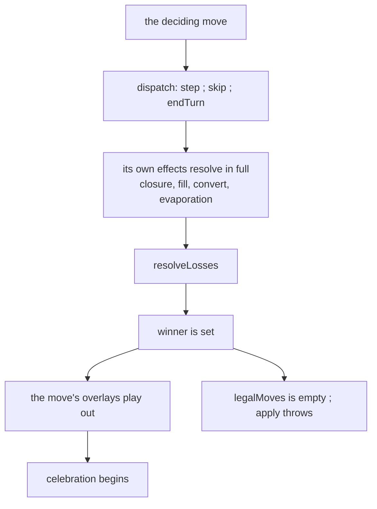

# A won match is over — P38

Resolves **SPEC §11 item 46**. Rules + adapter.

## Overview

Two rules and one sequencing rule.

```
apply(state, move):
  if state.winner !== undefined: throw ContractViolation   # NEW — the match is over
  next = dispatch(state, move)
  return resolveLosses(next)

legalMoves(state):
  if state.winner !== undefined: return []                 # NEW — nothing, not even the pass
  ...as before
```



## Why empty, and not "nothing but the pass"

P37 invariant 4 says a **lost** player is offered nothing but the pass, and the
reason is structural: `players[0]` is the round-boundary marker, and a seat is
*passed*, never skipped, so the round still has to advance through a dead seat's
slot. `legalMoves` returning `[]` there would hang the match.

A **won** match has no next turn to advance to. There is no round to close, no
seat to hand on, and nothing for a pass to mean. This is the one state where an
empty offer list is the correct answer rather than a deadlock — and it is worth
saying explicitly, because the two states look adjacent and the reasoning that
makes the pass mandatory in one makes it meaningless in the other.

## Why `apply` throws rather than returning the state unchanged

Two shapes were available and they are not equivalent.

**Returning the input unchanged** keeps `apply` total: a record that runs past the
win folds harmlessly to the winning state. That is the friendlier option for a
truncated log, and it is the wrong one here. A caller that applies a move and gets
back a state where nothing happened has no way to tell "the match is over" from
"that move was a no-op", and the engine would be silently absorbing a caller bug.

**Throwing `ContractViolation`** matches the invariant this repo already keeps in
both directions — *everything `legalMoves` offers, `apply` accepts*, and P28's
precedent that an illegal step throws rather than degrading. It makes the caller
error loud at the point it happens.

The cost is real and is accepted: **a replay that runs past the win now throws.**
The reported playtest log has four moves recorded after 1242, so the fixture must
be sliced at the win rather than folded whole. That is the correct reading of the
log — those moves were accepted by an engine that had not yet noticed the match
was decided — and slicing it is not working around the change, it is recording
what the log actually contains.

## The winning move is not truncated

`resolveLosses` sits at the **tail** of `apply` (P37), after `dispatch` has run
every effect the move causes. That ordering is what makes "the winning move only
invokes effects" true, and it is now load-bearing rather than incidental: an
implementation that noticed a win early and skipped the rest of the pass would
produce a board missing the fill, the conversion, or the evaporation that won the
match.

The refusal is therefore at the **top** of `apply`, gating the *next* move, and
never inside the pass gating the current one.

## When the celebration begins

The adapter derives the celebration from `state.winner` alone today, so it paints
on the same frame the winning move commits, over that move's own overlays. It
shall instead begin once the effects of the winning move have **finished
playing**.

Two constraints on how that is implemented:

- **It shall not gate input.** The fx queue's own contract is that it "never gates
  input" and is "allowed to be lossy under pressure". Waiting on it here does not
  break that: input is already locked, because `inputLocked` reads
  `winner !== undefined`, which is true from the deciding move onward.
- **It shall be bounded.** The queue is lossy by design — overlays are dropped past
  `MAX_FX_ITEMS` and pruned on their own lifetimes — so *"wait until the queue is
  empty"* alone could strand a match with no celebration at all if an overlay is
  ever dropped mid-flight. A ceiling makes the failure mode "the celebration came
  slightly early" instead of "the match never visibly ended". Derive it from the
  existing timing vocabulary rather than inventing a number:
  `MAJOR_SEQUENCE_MS` is already the stated bound on the biggest sequence in the
  game (enclosure → capture → production).

During the wait the board shall read as **playing**: no dim, no shine, no banner.
The transition is what carries the meaning.

## Cost

Both new gates are a single `undefined` check on a field already in hand. The
refusal is O(1) and runs before any board read, so a won state is *cheaper* to
call `legalMoves` on than a live one. Nothing here touches the vertex lattice, so
P37 invariant 16 is unaffected.

## Invariants (EARS)

1. When `state.winner` is set, the system shall offer no legal move.
2. When `state.winner` is set, the system shall refuse every move with a
   `ContractViolation`, and shall not return a state.
3. The system shall resolve every effect of the deciding move — closure, fill,
   conversion, and evaporation — in the state that move returns.
4. The system shall never refuse a move on account of a winner set by that same
   move.
5. A replay whose record continues past the deciding move shall refuse at the
   first move after it, and shall name that move.
6. On the reported playtest log the system shall refuse at move **1243**, the
   `endTurn` following the deciding step at 1242.
7. The system shall not mutate the input state when it refuses.
8. Equal won states shall refuse equal moves with equal messages.
9. The system shall reach a won state only through a move, never through
   `legalMoves`.
10. The adapter shall present the board as playing until the deciding move's
    overlays have finished, and as over thereafter.
11. The adapter shall begin the celebration no later than `MAJOR_SEQUENCE_MS`
    after the deciding move, whatever the queue contains.
12. The adapter shall not gate input on the celebration, which is already locked
    by `winner`.
13. The adapter shall begin the celebration exactly once per match.

## Out of scope

- §11 item 45 — whether a vanishing seat's trail evaporates rather than clearing,
  and the flicker-then-fade requested for it. P38 sequences the effects that
  exist; it adds none.
- The celebration's content (P29): dim, shine, pulse, banner.
- Restart or rematch from a finished board (P20+).
